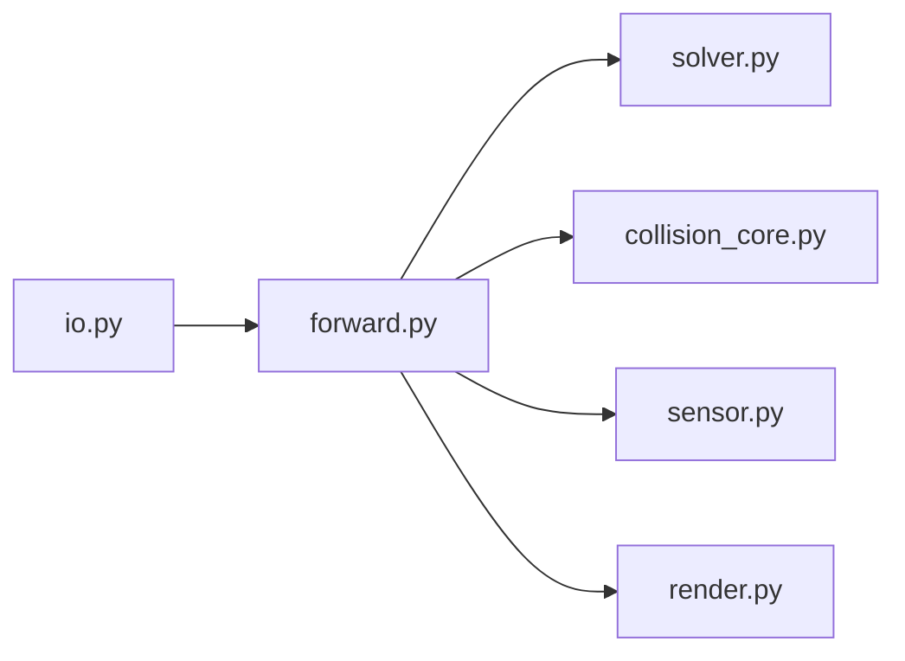

# google-deepmind/mujoco_warp

> Version GPU de MuJoCo (NVIDIA Warp) pour simuler massivement en parallèle en recherche robotique.

## Le problème
Entraîner des politiques de robotique par apprentissage exige des milliers de simulations parallèles que MuJoCo sur CPU traite mal.

## Ce que ça fait vraiment
Reprend l'API et les modèles MuJoCo avec des kernels Warp : dynamique, solveur de contraintes, collisions (primitives, SDF), capteurs, requêtes de rayons et rendu par lots (maillages, textures, splats gaussiens). Intégrable via MJX/JAX, Isaac Lab (via Newton) ou mjlab (PyTorch). Maintenu par Google DeepMind et NVIDIA.

## Comment c'est branché


## Essayer
```bash
git clone https://github.com/google-deepmind/mujoco_warp.git && cd mujoco_warp
python benchmarks/run.py -f unitree_g1_flat --view
pip install mujoco-warp
mjwarp-testspeed benchmarks/humanoid/humanoid.xml --event_trace
```

## Coût et pièges
GPU NVIDIA recommandé ; le CPU sert au développement. Pas de différentiabilité via Warp pour l'instant.

## Ce que ce n'est pas
Pas un équivalent complet de MuJoCo : l'intégrateur `IMPLICITFAST`, les solveurs PGS et noslip, les plugins ne sont pas gérés, et Flex reste expérimental.

## Alternatives
- MJX (JAX) : voie JAX citée dans le README.
- Isaac Lab et mjlab : intégrations PyTorch citées.

## Pour toi
À adopter si tu fais de l'apprentissage par renforcement en robotique avec un GPU NVIDIA : soutenu par DeepMind et NVIDIA, actif et documenté.

