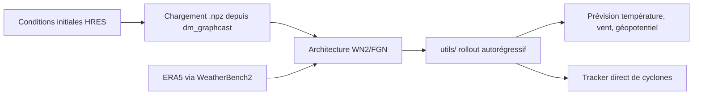

# google-deepmind/weathernext

> Code et poids des modèles DeepMind de prévision météo et de cyclones à moyenne échéance.

## Le problème
Reproduire une prévision météo par IA suppose des poids publiés, un tracker de cyclones et un
pipeline de rollout autorégressif — rarement disponibles ensemble.

## Ce que ça fait vraiment
Héberge WeatherNext 2, modèle global atmosphérique et cyclonique à 0,25° (~30 km), plus les
générations précédentes GraphCast et GenCast. Plusieurs jeux de poids : la version opérationnelle
initialisée sur les conditions HRES de l'ECMWF, les variantes Cyclones qui reproduisent les
résultats du papier par année, et des versions Mini à 1° pour matériel modeste. Le répertoire
`utils/` fournit le rollout autorégressif, la normalisation, les blocs de graphes, la perte et
les utilitaires xarray compatibles JAX.

## Comment c'est branché


## Essayer
```bash
pip install git+https://github.com/google-deepmind/weathernext.git@v0.3.0
```

## Coût et pièges
Le code est gratuit, le matériel non : les modèles non-Mini exigent une H100 pour la VRAM ; les
Mini passent sur une P100 ou un runtime Colab `v5e-1` gratuit. Optimisé TPU — sur GPU il faut
changer l'implémentation d'attention. L'entraînement complet suppose de télécharger ERA5, et ces
jeux de données ont leurs propres conditions d'utilisation à vérifier.

## Ce que ce n'est pas
Explicitement « pas un produit Google officiellement supporté », code de recherche fourni tel
quel, sans garantie de stabilité d'API — d'où la recommandation d'épingler une version. Ne
remplace ni n'est endossé par une agence météorologique : pas une source d'alerte officielle.

## Alternatives
- **Google Cloud / WeatherLab / OpenMeteo** : flux de données quotidiens, si tu ne veux pas faire tourner le modèle.

## Pour toi
Intéressant comme cas d'école de modèle géospatial ; lourd à exploiter hors contexte météo.
