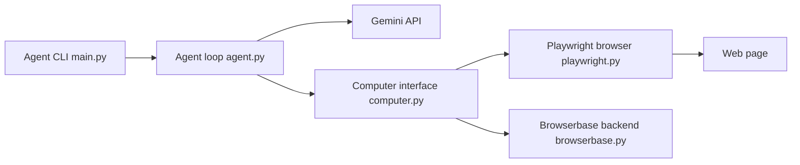

# google-gemini/computer-use-preview

> Agent CLI de démonstration qui pilote un navigateur avec Gemini (computer use) via Playwright ou Browserbase.

## Le problème
Tester la capacité de Gemini à agir sur des pages web demande de brancher le modèle, des captures d'écran et un navigateur.

## Ce que ça fait vraiment
`main.py` prend une requête en langage naturel. La boucle d'agent demande des actions à Gemini, les exécute dans un navigateur (Chrome local via Playwright ou session distante Browserbase) puis renvoie l'état de la page au modèle. Modèles : `gemini-3.6-flash` par défaut, ou d'autres variantes. API Gemini Developer ou Vertex AI.

## Comment c'est branché


## Essayer
```bash
git clone https://github.com/google-gemini/computer-use-preview.git
cd computer-use-preview
python3 -m venv .venv
source .venv/bin/activate
pip install -r requirements.txt
playwright install chrome
export GEMINI_API_KEY="YOUR_GEMINI_API_KEY"
python main.py --query "Go to Google and type 'Hello World' into the search bar" --env="playwright"
```

## Coût et pièges
Clé Gemini facturée ; Browserbase demande clé et projet. Problème connu : les listes déroulantes natives ne sont pas capturées par Playwright sur certains OS.

## Ce que ce n'est pas
Un « preview » de démonstration, pas un produit : aucune garantie de sécurité pour agir sur des sites réels.

## Alternatives
- Browserbase : backend navigateur distant déjà supporté.

## Pour toi
À surveiller : bon exemple de référence pour comprendre une boucle computer-use, à ne pas lancer sur des comptes sensibles.

