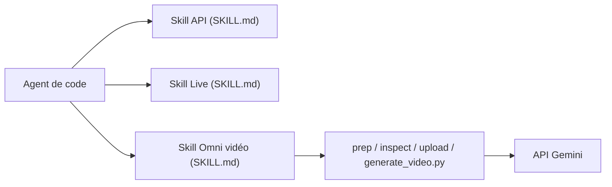

# google-gemini/gemini-skills

> Bibliothèque de skills pour agents de code qui connaissent les API Gemini à jour : SDK, Live API, vidéo.

## Le problème
Les LLM ont une connaissance figée et ignorent les nouveaux modèles, SDK et bonnes pratiques des API Gemini.

## Ce que ça fait vraiment
Trois skills : `gemini-api-dev` (texte, chat, streaming, appel de fonctions, sortie structurée, images, agents managés, Deep Research, SDK Python et TypeScript), `gemini-live-api-dev` (flux bidirectionnels audio/vidéo/texte via WebSocket) et `gemini-omni-flash-api` (génération et édition vidéo avec scripts de préparation, inspection, envoi et génération). Les évaluations des auteurs annoncent 87 % de code correct avec Gemini 3 Flash et 96 % avec Gemini 3.1 Pro.

## Comment c'est branché


## Essayer
```bash
npx skills add google-gemini/gemini-skills --list
npx skills add google-gemini/gemini-skills --skill gemini-api-dev
/plugin marketplace add google-gemini/gemini-skills
```

## Coût et pièges
Les skills sont gratuites ; l'usage de l'API Gemini est à ta charge. Les chiffres d'évaluation viennent de Google. La skill Vertex AI a été déplacée vers un autre chemin.

## Ce que ce n'est pas
Pas un SDK ni un produit officiellement supporté : le dépôt le dit lui-même. Ce sont des instructions pour agents, pas de la logique d'exécution.

## Alternatives
Non documenté dans le README : aucune alternative nommée.

## Pour toi
À surveiller si tu codes avec Gemini via un agent : peu coûteux à essayer et utile contre les API obsolètes ; sans Gemini dans ta pile, tu n'en as pas l'usage.

