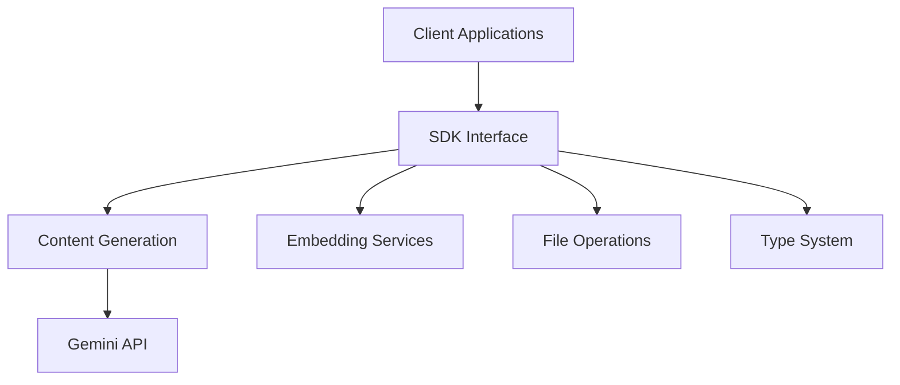

# google-gemini/generative-ai-python

> Ancien SDK Python pour l'API Gemini, désormais remplacé par le SDK Google Gen AI unifié.

## Le problème
Appeler les modèles Gemini depuis Python.

## Ce que ça fait vraiment
Le README ne contient que l'avis de dépréciation : maintenance limitée aux corrections critiques, fin de tout support le 30 novembre 2025, et renvoi vers un guide de migration. Le diagramme mentionne GenerativeModel, sessions de chat, embeddings, fichiers, cache.

## Comment c'est branché

## Essayer
Aucune commande documentée dans le README (renvoi au guide de migration).

## Coût et pièges
Clé d'API Gemini. Le catalogue indique « archivé : non » malgré la fin de support annoncée.

## Ce que ce n'est pas
Pas un SDK à adopter aujourd'hui : il est en fin de vie.

## Alternatives
- Google Gen AI SDK : successeur unifié cité dans le README (nom du dépôt non donné).

## Pour toi
À ignorer : support terminé, migre vers le SDK Google Gen AI si tu utilises encore ce paquet.
