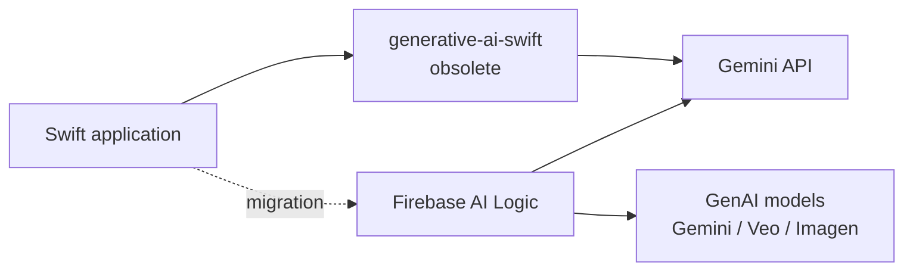

# google-gemini/generative-ai-swift

> **Google's former Swift SDK for the Gemini API, declared obsolete by its publisher.**

## The problem

Calling the Gemini API from a Swift application required a dedicated client, which this
repository used to provide. The README now states plainly that it should not be used.

## What it actually does

The README describes no feature at all: it is entirely given over to the end-of-life notice.
It says that with Gemini 2.0, Google built a unified SDK for mobile developers who want to
use its GenAI models (Gemini, Veo, Imagen, etc.), taking the feedback gathered on this SDK
and folding the work directly into the Firebase SDK. Nothing further will be added here and
no further changes are planned.

## How it is wired

No code-derived diagram is available, and the README no longer describes any architecture.
The only documented path is the migration one.

## Trying it

No command is documented in the README: there is no installation step and no usage example.
The README points to the Firebase AI Logic getting-started documentation instead.

## Cost and gotchas

An API client SDK implies a Gemini API key, billed to the caller; the README gives no pricing
information. The main gotcha is stated outright: the repository is frozen, so expect no fixes
and no support for newer API features.

## What it is not

It is not an SDK to adopt: the README title opens with "Obsolete - DO NOT USE". It is not a
Git-archived repository either — it still reads fine — but its publisher says nothing more
will land in it. No license is mentioned anywhere in the README.

## Alternatives

The README names a single replacement: the **Firebase SDK / Firebase AI Logic**, presented as
the unified SDK for Google's GenAI models on mobile. No other comparable alternative is named
in the catalogue.

## Why it matters to you

Ignore it, except as a lesson in how Google's SDK lines move. If an existing iOS project
depends on it, the README names the exit: Firebase AI Logic.
