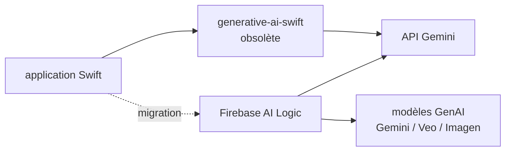

# google-gemini/generative-ai-swift

> **Ancien SDK Swift de Google pour l'API Gemini, déclaré obsolète par son éditeur.**

## Le problème

Appeler l'API Gemini depuis une application Swift demandait un client dédié. C'est ce que ce
dépôt fournissait. Le README indique aujourd'hui qu'il ne faut plus l'utiliser.

## Ce que ça fait vraiment

Le README ne décrit aucune fonctionnalité : il est entièrement consacré à l'annonce de
l'arrêt. Il précise qu'avec Gemini 2.0, Google a créé un SDK unifié pour les développeurs
mobiles souhaitant utiliser ses modèles GenAI (Gemini, Veo, Imagen, etc.), en reprenant les
retours faits sur ce SDK-ci, et que ce travail a été porté directement dans le Firebase SDK.
Le README annonce qu'aucun ajout ni aucune modification n'est prévu ici.

## Comment c'est branché

Aucun diagramme tiré du code n'est disponible, et le README ne décrit plus l'architecture.
Le seul chemin documenté est celui de la migration.

## Essayer

Aucune commande n'est documentée dans le README : il ne contient ni installation, ni exemple
d'usage. Le README renvoie vers la documentation de Firebase AI Logic pour démarrer.

## Coût et pièges

Un SDK client d'API implique une clé d'API Gemini, à la charge de l'appelant : le README ne
donne aucune information de tarification. Le piège principal est explicite : le dépôt n'est
plus mis à jour, donc pas de correctif ni de support des nouveautés de l'API.

## Ce que ce n'est pas

Ce n'est plus un SDK à adopter : le titre du README commence par « Obsolete - DO NOT USE ».
Ce n'est pas non plus un dépôt archivé au sens Git — il reste lisible — mais son éditeur
annonce qu'il n'y ajoutera rien. Aucune licence n'est mentionnée dans le README.

## Alternatives

Le README nomme une seule cible de remplacement : le **Firebase SDK / Firebase AI Logic**,
présenté comme le SDK unifié pour les modèles GenAI de Google côté mobile. Aucune autre
alternative comparable n'est nommée dans le catalogue.

## Pour toi

À ignorer, sauf pour comprendre la trajectoire des SDK Google : si un projet iOS existant en
dépend, le README indique la sortie à prendre, Firebase AI Logic.
