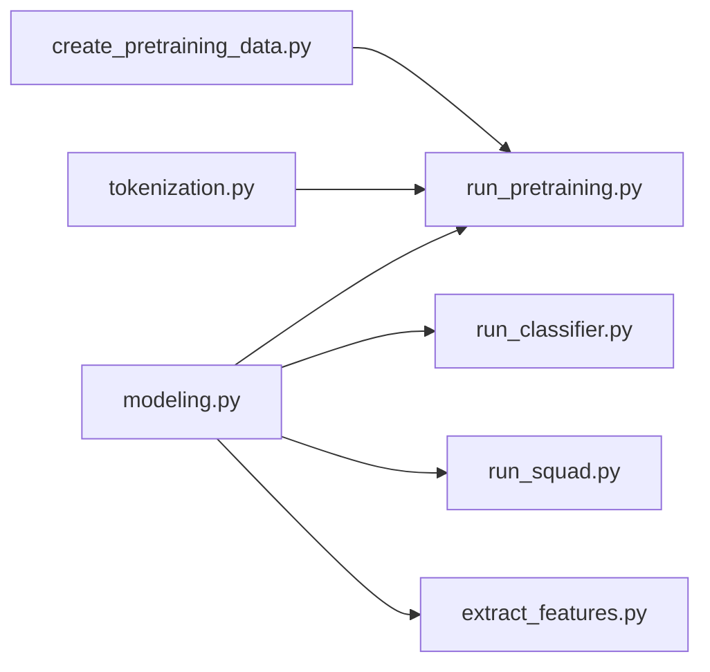

# google-research/bert

> Code TensorFlow 1 et poids originaux de BERT, pour référence historique en NLP.

## Le problème
En 2018, il manquait un encodeur pré-entraîné bidirectionnel réutilisable pour les tâches NLP.

## Ce que ça fait vraiment
`modeling.py` définit le Transformer, `tokenization.py` le WordPiece, `create_pretraining_data.py` + `run_pretraining.py` le pré-entraînement (masked LM, next sentence), `run_classifier.py` et `run_squad.py` le fine-tuning, `extract_features.py` les embeddings. Poids Base, Large, multilingue, chinois, et 24 petits modèles.

## Comment c'est branché


## Essayer
```bash
python run_classifier.py --task_name=MRPC --do_train=true --do_eval=true --data_dir=$GLUE_DIR/MRPC --vocab_file=$BERT_BASE_DIR/vocab.txt --bert_config_file=$BERT_BASE_DIR/bert_config.json --init_checkpoint=$BERT_BASE_DIR/bert_model.ckpt --max_seq_length=128 --train_batch_size=32 --learning_rate=2e-5 --num_train_epochs=3.0 --output_dir=/tmp/mrpc_output/
```

## Coût et pièges
Testé avec TensorFlow 1.11 ; BERT-Large ne tient pas sur un GPU 12-16 Go. Mono-GPU uniquement.

## Ce que ce n'est pas
Pas une base moderne : archivé, TF1, sans PyTorch officiel.

## Alternatives
- Version PyTorch de HuggingFace, citée par le README, compatible avec les checkpoints.

## Pour toi
Lecture historique seulement ; en pratique, passe par l'écosystème HuggingFace.
