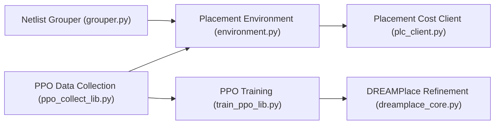

# google-research/circuit_training

> AlphaChip : framework RL distribué de floorplanning de puces, reproduisant l'article Nature 2021.

## Le problème
Placer des macros sur une puce en optimisant longueur de fils, congestion et densité prend des semaines à des concepteurs.

## Ce que ça fait vraiment
Regroupe les netlists en clusters, expose un environnement de placement (coût calculé par un binaire externe), entraîne un agent PPO à réseau de neurones de graphes avec collecte distribuée (TF-Agents, Reverb), puis peut affiner les cellules standard avec DREAMPlace. Gère macros fixes, orientation, alignement et contraintes d'espacement.

## Comment c'est branché


## Essayer
```bash
export CT_VERSION=0.0.4
git clone https://github.com/google-research/circuit_training.git
git -C $(pwd)/circuit_training checkout r${CT_VERSION}
docker build --pull --no-cache --tag circuit_training:core -f "${REPO_ROOT}"/tools/docker/ubuntu_circuit_training ${REPO_ROOT}/tools/docker/
bash tools/e2e_smoke_test.sh --root_dir /workspace/logs
```

## Coût et pièges
Linux seulement, Python 3.9, pas de paquet PyPI. DREAMPlace est à compiler ou à prendre en binaire fourni ; les branches vieillissent avec TF-Agents. Le smoke test dure 10 à 20 minutes.

## Ce que ce n'est pas
Pas un outil EDA prêt à l'emploi : projet de recherche, non officiel Google. Le modèle pré-entraîné complet n'est pas partagé, seul un checkpoint sur 20 blocs TPU l'est.

## Alternatives
Aucune alternative nommée dans le README.

## Pour toi
À surveiller : intéressant comme cas d'école de RL industriel, mais sans usage direct hors conception de puces.
