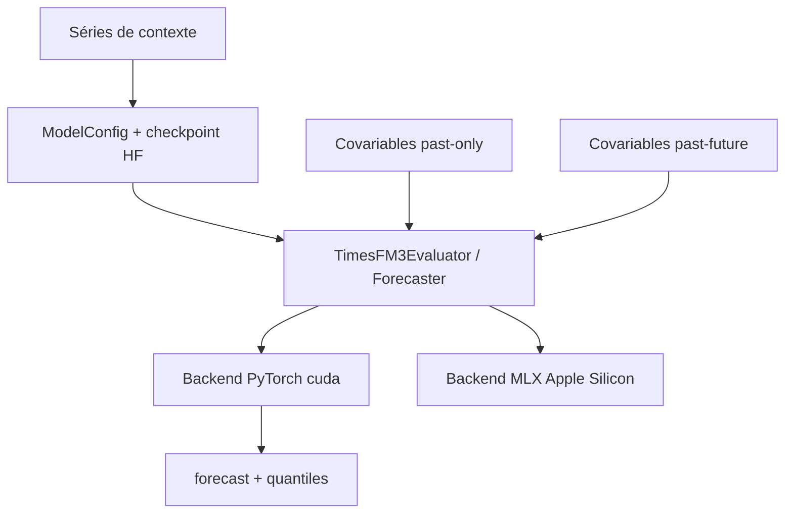

# google-research/timesfm

> Modèle de fondation préentraîné de Google Research pour la prévision de séries temporelles.

## Le problème
Prévoir une série temporelle demande d'entraîner un modèle par série, ou presque, et de refaire le réglage à chaque jeu de données.
Les covariables et le multivarié obligent souvent à changer complètement d'approche.

## Ce que ça fait vraiment
Modèle décodeur seul préentraîné pour la prévision, utilisable en zéro-shot ; version courante 3.0, checkpoint `google/timesfm-3.0-pytorch`.
La 3.0 apporte le multivarié natif et les covariables passées seules ou passées-et-futures, sans réglage par tâche.
API `predict` / `predict_batch` : liste de séries 1D de longueurs variables, ou tableau 2D `(num_variates, context_length)`, avec prédiction médiane et 9 quantiles.
Backend MLX natif pour Apple Silicon, numériquement aligné sur PyTorch (erreur max de l'ordre de 1e-6), exemple de fine-tuning LoRA via Transformers + PEFT, tests unitaires et `SKILL.md` pour agents.

## Comment c'est branché


## Essayer
```shell
pip install timesfm[torch]
pip install timesfm[mlx]
```

```shell
git clone https://github.com/google-research/timesfm.git
cd timesfm
uv venv && source .venv/bin/activate
uv pip install -e .[torch]
```

## Coût et pièges
Gratuit ; les exemples utilisent `device="cuda"`, donc GPU attendu côté PyTorch (le backend MLX s'en passe sur Apple Silicon).
Les contextes plus longs que `global_context` (15 360) sont tronqués aux points les plus récents, silencieusement.

## Ce que ce n'est pas
Ce n'est pas un produit Google officiellement supporté : le README le dit explicitement pour cette version ouverte.
Ce n'est pas un pipeline de prévision complet : pas de préparation de données, de détection de saisonnalité ni de monitoring.
Les rangs de benchmark annoncés (fev-bench, TIME, GIFT-Eval) sont rapportés par le projet.

## Alternatives
Aucune alternative n'est nommée dans le README ; il cite les intégrations Google (BigQuery ML, Sheets, Vertex Model Garden).

## Pour toi
Le premier réflexe à avoir sur une nouvelle série temporelle : une baseline zéro-shot avant d'entraîner quoi que ce soit.
