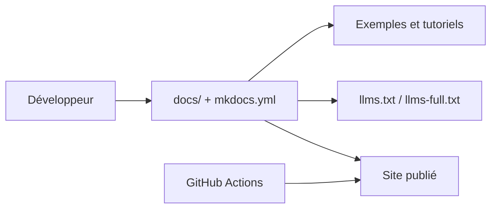

# google/adk-docs

> Dépôt de documentation d'Agent Development Kit, boîte à outils code-first pour agents IA.

## Le problème
Construire des agents multi-étapes demande une structure claire (outils, orchestration, évaluation, déploiement) plutôt qu'un empilement de scripts.

## Ce que ça fait vraiment
Le README présente ADK comme un cadre modulaire, agnostique du modèle et du déploiement, optimisé pour Gemini. Il renvoie aux guides Python, TypeScript, Go, Java et Kotlin, et fournit `llms.txt` et `llms-full.txt` pour donner la documentation à des assistants de code. Le dépôt lui-même contient le site de documentation, pas le cadre.

## Comment c'est branché

## Essayer
Aucune commande documentée dans le README : il renvoie vers les guides de démarrage par langage.

## Coût et pièges
Gratuit pour la doc. L'usage d'ADK implique les modèles et services choisis (Gemini, Cloud Run, GKE, Agent Runtime) et leurs coûts ; le README n'en détaille aucun.

## Ce que ce n'est pas
Pas le code d'ADK : c'est le dépôt de documentation. La description d'architecture fournie décrit la bibliothèque, alors que le dépôt contient surtout des pages et la chaîne de publication.

## Alternatives
Aucune alternative nommée dans le README.

## Pour toi
À surveiller : source de référence pour concevoir des agents, à lire si tu évalues ADK ; l'outil lui-même est dans d'autres dépôts.
