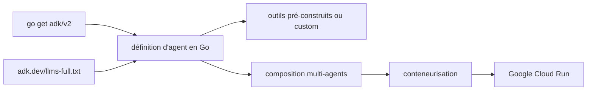

# google/adk-go

> Boîte à outils Go de Google pour construire, évaluer et déployer des agents IA.

## Le problème
Écrire un agent en Go oblige à recoder orchestration, outils et évaluation, sans les briques disponibles côté Python.

## Ce que ça fait vraiment
Fournit un framework modulaire qui applique les principes du développement logiciel à la création d'agents.
Logique d'agent, outils et orchestration définis directement en Go, pour la testabilité et le versionnement.
Systèmes multi-agents par composition d'agents spécialisés.
Optimisé pour Gemini mais annoncé agnostique au modèle, au déploiement et aux autres frameworks.

## Comment c'est branché


## Essayer
```bash
go get google.golang.org/adk/v2
```

## Coût et pièges
Un modèle est nécessaire : optimisé pour Gemini, donc clé d'API à ta charge. Le README ne dit rien des quotas ni des coûts. Rien n'indique quelles briques sont stables.

## Ce que ce n'est pas
Le README ne montre aucun exemple de code : il renvoie à `adk.dev/llms.txt` et `llms-full.txt`, deux index pensés pour être donnés à un agent de code plutôt que lus. Pas de description des concepts (outils, sessions, évaluation) dans le dépôt lui-même. Pas la version de référence : c'est le portage Go d'un ADK existant.

## Alternatives
Aucune alternative nommée dans le README.

## Pour toi
À surveiller seulement si ton stack agent est en Go ; sinon, la version Python du même ADK est mieux documentée.
