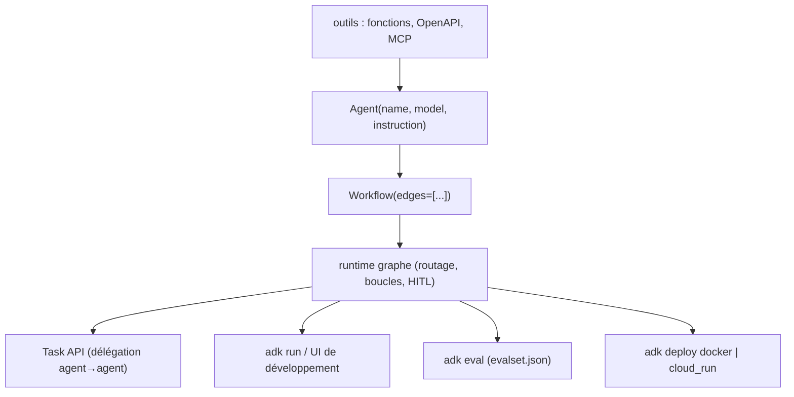

# google/adk-python

> Cadre Python code-first de Google pour construire, évaluer et déployer des agents.

## Le problème
Un système multi-agents écrit à la main mélange logique métier, orchestration et reprise sur erreur :
rien n'est testable isolément, et le déploiement se réinvente à chaque projet.

## Ce que ça fait vraiment
Deux classes centrales : `Agent` (instructions, outils, comportement) et `Workflow` (graphe d'exécution
déclaré par `edges`). Le runtime de workflow gère routage, fan-out/fan-in, boucles, réessais, état,
nœuds dynamiques, humain dans la boucle et workflows imbriqués. Une Task API structure la délégation
entre agents (multi-tours, sortie contrôlée en un tour, agents-tâches comme nœuds). Outils préfabriqués,
fonctions, specs OpenAPI, outils MCP, et une confirmation d'outil qui peut bloquer une exécution.
Une UI de développement, `adk eval` pour l'évaluation, et un déploiement Docker ou Cloud Run.

## Comment c'est branché


## Essayer
```bash
pip install google-adk
adk run path/to/my_agent
adk eval samples_for_testing/hello_world samples_for_testing/hello_world/hello_world_eval_set_001.evalset.json
adk deploy cloud_run --with_ui <agent-folder>
```

## Coût et pièges
Python 3.10+. Le README recommande d'installer avec les fichiers de contraintes fournis
(`constraints-3.10.txt` et suivants) pour se protéger des dépendances transitives — signe d'un arbre
de dépendances instable. Le déploiement Cloud Run et Vertex AI Agent Engine se facture chez Google,
et les modèles aussi. Cadence de publication d'environ deux semaines.

## Ce que ce n'est pas
Pas lié à Gemini : le README le dit optimisé pour Gemini mais agnostique au modèle, au déploiement
et aux autres cadres. Pas un produit hébergé : c'est une bibliothèque. La version `@main` contient
des changements expérimentaux et n'est pas destinée à la production.

## Alternatives
- Agent Config : le mode sans code du même projet, si le graphe suffit.

## Pour toi
Le cadre d'agents le plus sérieusement outillé côté évaluation et déploiement — à évaluer contre ton existant.
