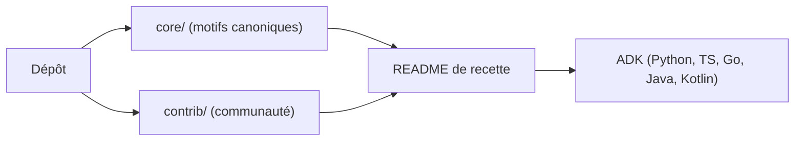

# google/adk-samples

> Collection publique de recettes d'agents ADK exécutables, à forker comme point de départ.

## Le problème
Démarrer un agent avec l'Agent Development Kit sur une page blanche est long sans exemples concrets.

## Ce que ça fait vraiment
Des recettes en deux dossiers : `core/` (motifs canoniques : OAuth, mémoire de session, garde-fous, RAG) et `contrib/` (contributions de la communauté par cas d'usage). Chaque recette a son propre README d'installation. Le README cite les SDK ADK Python, TypeScript, Go, Java et Kotlin. Le schéma fourni, rédigé en chinois, décrit un ancien découpage `java/agents` et `python/agents` (bug assistant, prévision de séries temporelles, recherche académique, etc.) qui ne colle pas au README.

## Comment c'est branché

## Essayer
Aucune commande documentée dans le README : installer ADK d'après son guide, puis suivre le README de chaque recette.

## Coût et pièges
Un modèle ou une clé d'API sont probablement nécessaires selon la recette, non précisé ici. Le README indique un produit non supporté officiellement, hors du programme de primes de vulnérabilités de Google.

## Ce que ce n'est pas
Pas un produit ni une base pour la production : « for demonstration and as starting points, not production use ». Incohérence entre README et schéma : le contenu réel des recettes n'est pas vérifiable ici.

## Alternatives
Aucune alternative nommée dans le README.

## Pour toi
À surveiller : bon réservoir d'exemples si tu construis des agents avec ADK, mais README court et sans support officiel.

