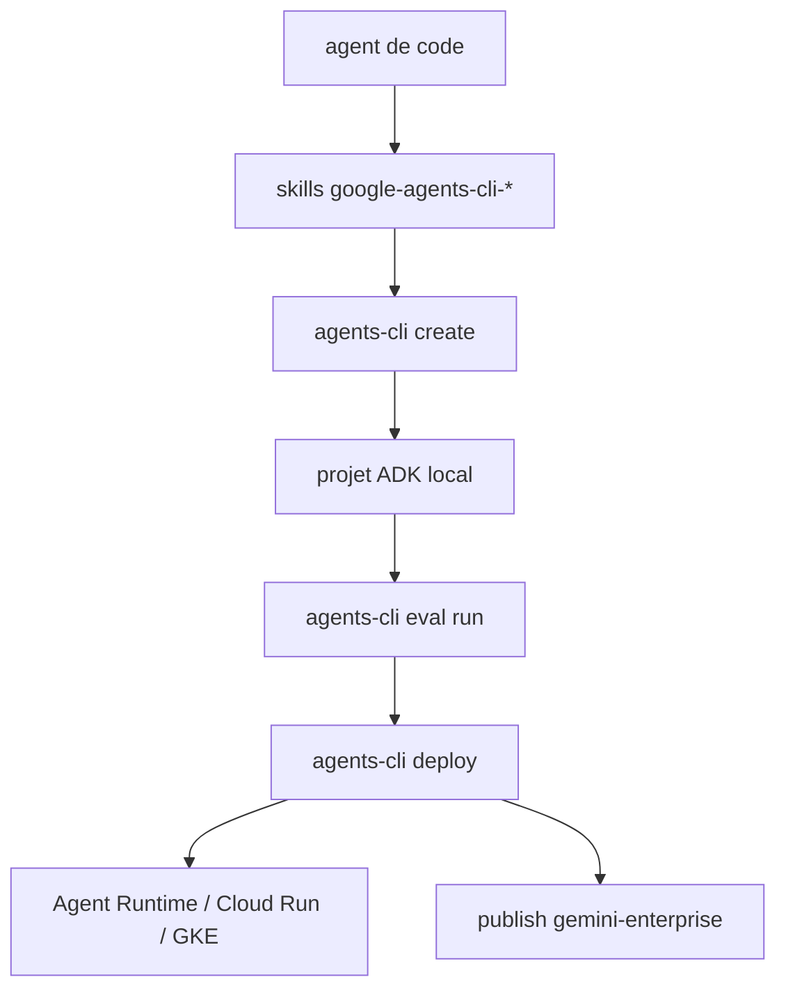

# google/agents-cli

> CLI et skills qui apprennent à ton agent de code à livrer des agents ADK sur Google Cloud.

## Le problème
Construire un agent ADK et le déployer demande de connaître une pile de services Google Cloud, chacun avec sa CLI et ses conventions.
Un assistant de code livré à lui-même invente les commandes de déploiement et d'évaluation.

## Ce que ça fait vraiment
Sept skills (`workflow`, `adk-code`, `scaffold`, `eval`, `deploy`, `publish`, `observability`) injectent les conventions ADK dans Claude Code, Codex ou Antigravity.
La CLI elle-même couvre le cycle : `create` échafaude un projet, `run` l'exécute sur un prompt, `eval run` rejoue un dataset et note les traces.
`eval` va plus loin que le smoke test : synthèse de scénarios multi-tours, comparaison de deux runs, clustering des modes d'échec, auto-tuning des prompts.
`deploy` cible Agent Runtime, Cloud Run ou GKE, et `publish gemini-enterprise` enregistre l'agent dans le catalogue d'entreprise.

## Comment c'est branché


## Essayer
```bash
uvx google-agents-cli setup
# ou seulement les skills :
npx skills add google/agents-cli
```

## Coût et pièges
Le local (`create`, `run`, `eval`) tourne avec une simple clé AI Studio ; dès `deploy` tu provisionnes des ressources dans ton propre projet Google Cloud et tu les payes.
Prérequis cumulés : Python 3.11+, uv et Node.js. Aucune licence n'est annoncée dans le README.

## Ce que ce n'est pas
Ce n'est pas un agent de code — le README le dit explicitement, c'est un outil *pour* un agent. Ce n'est pas non plus un remplacement d'ADK, qui reste le framework sous-jacent.
Et ce n'est pas portable : la moitié de la valeur est adhérente à Google Cloud et à Gemini Enterprise.

## Alternatives
- `agent-skills` : cité par le README pour les workflows d'ingénierie généraux (idéation, revue), pas le déploiement d'agents.
- `google/skills` : les fondations Google Cloud (BigQuery, Cloud Run, Firebase, GKE) si ton besoin est l'infra plutôt que l'agent.
- ADK seul : suffisant si tu n'as pas besoin de la chaîne éval/déploiement.

## Pour toi
Pertinent uniquement si ta prod est sur Google Cloud ; la partie `eval` (clustering des échecs, optimisation de prompts) est la seule réutilisable ailleurs.
