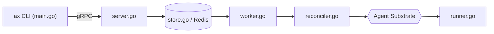

# google/ax

> Orchestrateur déclaratif façon kubectl pour lancer des tâches d'agents sandboxées sur Kubernetes.

## Le problème
Un agent n'est ni un microservice sans état ni un batch : il accumule de l'état, exige de l'isolation, appelle des API de modèles et peut brûler du budget en boucle sans que personne ne regarde.

## Ce que ça fait vraiment
Trois manifestes `ax.io/v1alpha1` : `Task` (sandbox avec limites CPU/mémoire), `Workspace` (dépôts Git, serveurs MCP, skills pré-câblés), `Model` (LLM et identifiants tirés d'un secret Kubernetes).
Le CLI parle en gRPC au control plane ; l'API stocke les ressources dans Redis, un worker réconcilie chaque tâche en acteur sur Agent Substrate.
Dans le conteneur, un runner prépare le workspace et sert les métadonnées de la tâche.
Verbes propres aux agents : `ax suspend` / `ax resume` (checkpoint), `ax ssh` dans la sandbox, `ax watch`.

## Comment c'est branché


## Essayer
```bash
kubectl get svc api -n ate-system
go install github.com/google/ax/cmd/ax@latest
make deploy AX_IMAGE_REPO=<your-registry>
ax apply -f examples/task.yaml
ax get tasks
ax watch task task123
ax ssh task123 -- ls -la /workspace
```

## Coût et pièges
Il faut un cluster Kubernetes avec Agent Substrate déjà installé, Go, `kubectl`, `ko` et un registre d'images accessible au cluster. Les appels au modèle (Gemini dans l'exemple) sont à ta charge.

## Ce que ce n'est pas
Pas un framework d'agent : il héberge et isole, il n'écrit pas la logique de l'agent.
Pas stable : le README annonce des changements cassants majeurs avant la version stable.
Pas un outil de poste de travail : sans cluster, rien ne tourne.

## Alternatives
Aucune alternative nommée dans le README.

## Pour toi
À suivre si tu fais tourner des agents en nombre sur Kubernetes ; trop tôt pour s'y engager.
