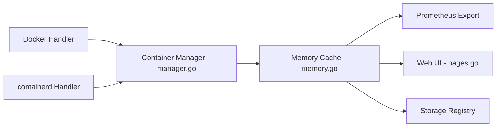

# google/cadvisor

> Démon qui collecte et expose l'usage ressources et les performances des conteneurs en cours d'exécution.

## Le problème
Savoir ce que consomment réellement les conteneurs (CPU, mémoire, réseau, disque) sur une machine.

## Ce que ça fait vraiment
Un démon découvre les conteneurs (Docker, Podman, containerd, CRI-O, brut), conserve l'historique d'usage et le sert via une interface web, une API REST versionnée, un endpoint Prometheus et des pilotes de stockage (dont BigQuery). Métriques perf et resctrl optionnelles ; client Go officiel ; déployable en DaemonSet Kubernetes.

## Comment c'est branché


## Essayer
```bash
VERSION=0.55.1
sudo docker run \
  --volume=/:/rootfs:ro \
  --volume=/var/run:/var/run:ro \
  --volume=/sys:/sys:ro \
  --volume=/var/lib/docker/:/var/lib/docker:ro \
  --volume=/dev/disk/:/dev/disk:ro \
  --publish=8080:8080 --detach=true --name=cadvisor \
  --privileged --device=/dev/kmsg \
  ghcr.io/google/cadvisor:$VERSION
```

## Coût et pièges
Gratuit. Le conteneur tourne en `--privileged` et monte des répertoires système en lecture seule. Instructions spécifiques pour CentOS, Fedora, RHEL.

## Ce que ce n'est pas
Pas une solution de supervision complète : pas d'alertes ni de stockage long terme sans backend externe. Licence non identifiée par GitHub.

## Alternatives
Aucune alternative nommée dans le README.

## Pour toi
À adopter pour exposer des métriques conteneurs à Prometheus (jobs d'entraînement, serveurs d'inférence) : sobre, éprouvé et maintenu par une équipe active.

