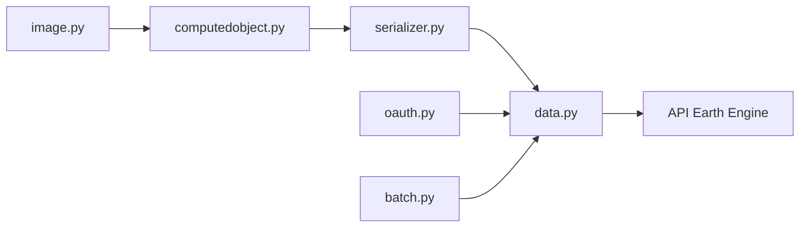

# google/earthengine-api

> Clients Python et JavaScript pour calculer sur les données géospatiales de Google Earth Engine.

## Le problème
Traiter des archives satellites à l'échelle planétaire est impossible sur une machine locale.

## Ce que ça fait vraiment
Tu composes des opérations sur images et collections ; le client sérialise l'expression, l'envoie à l'API Earth Engine, puis récupère les résultats, exports ou tuiles. Authentification OAuth, tâches batch, ligne de commande, client de tuiles. Le calcul se fait côté serveur Google.

## Comment c'est branché

## Essayer
Aucune commande documentée dans le README (renvoi vers la page d'installation Python). Un exemple JavaScript du Code Editor est fourni (tendance des lumières nocturnes).

## Coût et pièges
Compte Earth Engine requis ; l'offre tarifaire n'est pas détaillée dans le README. Les bugs se signalent sur le Google Issue Tracker, pas sur GitHub.

## Ce que ce n'est pas
Pas un moteur local : sans service Google, rien ne tourne.

## Alternatives
Aucune citée dans le README.

## Pour toi
Référence pour l'observation de la Terre et les séries temporelles raster : adopter si tu fais de la géo, en acceptant la dépendance à Google.

