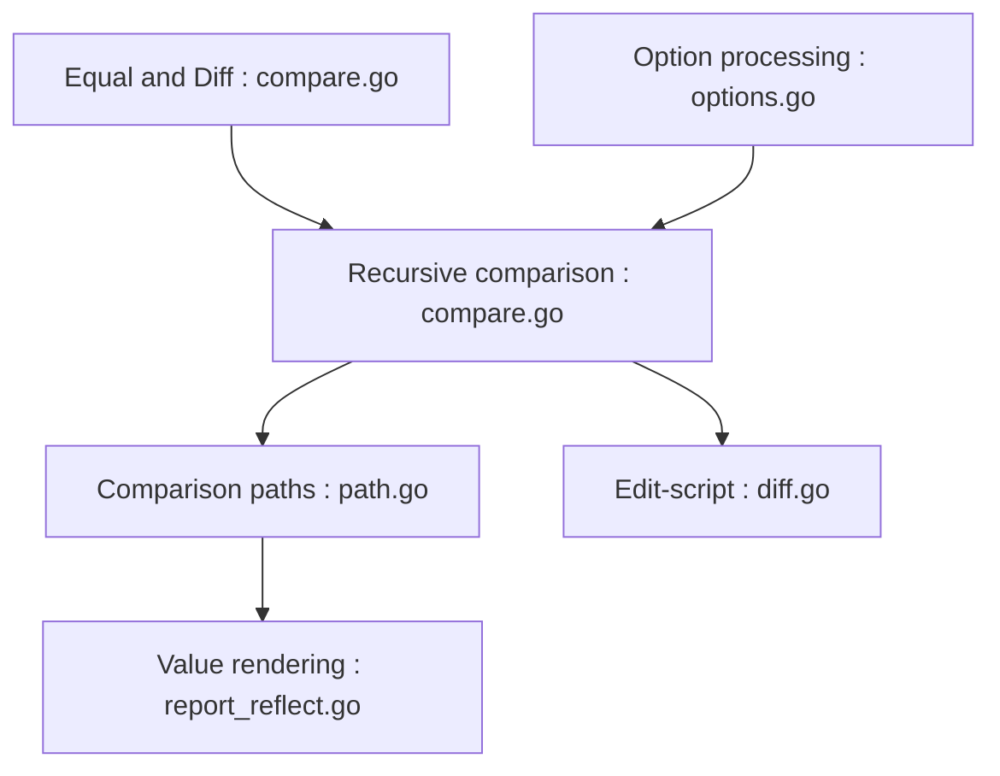

# google/go-cmp

> Paquet Go pour comparer des valeurs de façon plus sûre et configurable que `reflect.DeepEqual`, surtout dans les tests.

## Le problème
`reflect.DeepEqual` ne gère pas les tolérances ni les méthodes `Equal` et ne dit pas où est la différence.

## Ce que ça fait vraiment
`cmp.Equal` compare récursivement, en utilisant les méthodes `Equal` quand elles existent ou des fonctions d'égalité personnalisées. Les champs non exportés provoquent une panique sauf si on les ignore ou autorise explicitement. `cmp.Diff` produit un rapport lisible. Le README précise que ce n'est pas un produit Google officiel.

## Comment c'est branché


## Essayer
```bash
go get -u github.com/google/go-cmp/cmp
```

## Coût et pièges
Gratuit. Le piège principal est la panique sur champs non exportés, à gérer avec `cmpopts.IgnoreUnexported`.

## Ce que ce n'est pas
Pas un framework de test complet. Réservé à Go.

## Alternatives
- reflect.DeepEqual : plus simple mais moins précis, d'après le README.

## Pour toi
À surveiller : utile seulement si tu écris du Go ; dans ce cas, c'est la référence pour comparer proprement dans les tests.

