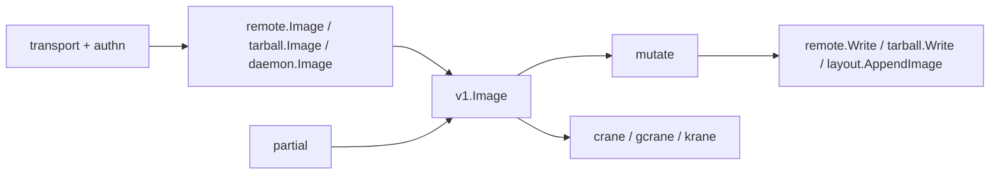

# google/go-containerregistry

> Bibliothèque Go pour lire, écrire et transformer des images de conteneurs et des registres.

## Le problème
Manipuler une image de conteneur depuis du code oblige à parler au registre à la main.
Chaque support — registre, tarball, daemon, disque — a ses propres règles.

## Ce que ça fait vraiment
Des interfaces immuables (`v1.Image`, `v1.Layer`, `v1.ImageIndex`) portées par plusieurs supports.
Des sources et des puits interchangeables : `remote`, `tarball`, `daemon`, `layout`, `random`, `stream`.
Le paquet `mutate` produit de nouvelles vues immuables à partir d'une image existante.
Le paquet `partial` évite d'implémenter toute l'interface ; `transport` et `authn` servent l'accès brut au registre.

## Comment c'est branché

## Essayer
Aucune commande documentée dans le README : il décrit les paquets et les outils, pas l'installation.

## Coût et pièges
Gratuit. L'accès au registre exige une authentification : `authn`, ou `k8schain` pour les identités Kubernetes.
Les vues peuvent être paresseuses ou mémoïsées : le coût réseau n'est pas là où on le croit.

## Ce que ce n'est pas
Pas un outil en ligne de commande, même si `crane`, `gcrane` et `krane` sont hébergés ici.
Pas un runtime de conteneur : rien n'est exécuté.
`ko`, né ici, vit désormais dans son propre dépôt.

## Alternatives
`crane` pour l'usage en ligne de commande, `gcrane` pour GCR, `krane` pour les identités Kubernetes.

## Pour toi
Utile seulement si tu écris du Go qui pousse ou récupère des images ; sinon c'est `crane` qui t'intéresse.
