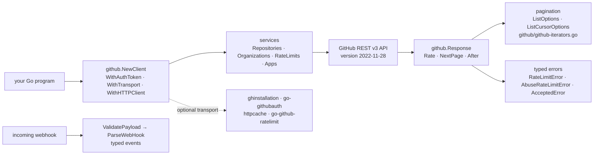

# google/go-github

> **The Go client for GitHub's REST API, for anyone automating repos, issues and webhooks.**

## The problem

Talking to GitHub's REST API by hand means rewriting the same plumbing in every project: URL
building, auth and API-version headers, JSON decoding of deeply nested structures, page-by-page
or cursor pagination, and detection of two distinct rate-limit regimes — without which the
program stops dead after a few hundred calls, with an error you cannot tell apart from a network
failure.

## What it actually does

go-github exposes GitHub's REST v3 API as a `github.Client` split into services
(`client.Organizations`, `client.Repositories`, `client.RateLimits`…) mirroring the structure of
GitHub's own documentation. Every method takes a `context.Context`, so cancellation and deadlines
come for free.

Resource structs use *pointer* fields for all non-repeated fields, so an unset field is
distinguishable from a zero value — at the price of `new("foo")` when writing.

Pagination comes three ways: `ListOptions` / `ListCursorOptions` with page data on
`github.Response`, and — since Go 1.23 — `*Iter` methods auto-generated by
`github/gen-iterators.go` into `github/github-iterators.go`, which you simply `range` over.

Rate limits are typed: `RateLimitError` for the primary limit, `AbuseRateLimitError` for the
secondary one, plus the context options `SleepUntilPrimaryRateLimitResetWhenRateLimited` and
`BypassRateLimitCheck`. `AcceptedError` covers endpoints returning 202 because the data is not
computed yet.

For webhooks, the library ships structs for almost every event, plus `ValidatePayload` (signature
check) and `ParseWebHook` to get a typed event out of an `http.Request`.

## How it is wired

No code-derived diagram exists for this repository: the graph below is reconstructed from the
README alone.



## Trying it

```bash
go get github.com/google/go-github/v92
```

```go
import "github.com/google/go-github/v92/github"
```

```go
client, err := github.NewClient()
if err != nil {
	// Handle error.
}

// list all organizations for user "willnorris"
orgs, _, err := client.Organizations.List(context.Background(), "willnorris", nil)
```

With a token, and for the top-of-trunk version:

```bash
go get github.com/google/go-github/v92@master
```

```go
client, err := github.NewClient(github.WithAuthToken("... your access token ..."))
```

## Cost and gotchas

- **The token is on you**: the library is free, access is not free of identity. The README says
  unauthenticated clients may only read public data and get a low rate limit. You need a personal
  access token or a GitHub App.
- **Two rate limits, not one**: primary (request count) and secondary (concurrency), with
  stricter limits on search endpoints. Handle both error types, or plug in a dedicated transport
  (`gofri/go-github-ratelimit`).
- **Conditional requests are not handled**: go-github does no ETag logic itself; it is designed
  to sit behind a caching `http.Transport` (`bartventer/httpcache`, or
  `bored-engineer/github-conditional-http-transport` for short-lived credentials).
- **GitHub App auth is out of scope**: it goes through third-party packages
  (`bradleyfalzon/ghinstallation`, `jferrl/go-githubauth`).
- **The import path carries the major version** (`.../v92/github`), and majors bump on every
  incompatible API change: upgrades are frequent and touch every import.
- **Narrow Go window**: the README follows Go's support policy — the latest two majors — and
  since Go 1.26 the `go` directive in `go.mod` declares a hard minimum, so N-1 by default.
- **An authenticated client must not be shared** between users: the token rides on all its calls.

## What it is not

- **It is not a GraphQL client.** The README points explicitly to `shurcooL/githubv4` for API v4.
  go-github covers REST v3 only.
- **It is not a command-line tool**: nothing to run, it is a Go package you import. It is not
  `gh` either.
- **It is not an abstraction that shields you from the service**: GitHub preview features are
  implemented aggressively and explicitly treated as unstable, and the calendar API version
  (2022-11-28) is a moving parameter underneath the library.

## Alternatives

| | When to prefer it |
|---|---|
| **shurcooL/githubv4** | Recommended by the README itself for the GraphQL v4 API: prefer it when you want to pick the returned fields and avoid round trips; go-github stays the REST choice. |
| **migueleliasweb/go-github-mock** | Named in the README: a complement rather than a competitor — add it to test code calling go-github without hitting the real API. |
| **gofri/go-github-ratelimit** | Named in the README: an `http.RoundTripper` that handles both rate limits for you, paired with `DisableRateLimitCheck`. |

The catalogue neighbours (`avelino/awesome-go`, `JanDeDobbeleer/oh-my-posh`, `samber/lo`,
`lowlighter/metrics`) are not comparable: none is a GitHub API client.

## For you

Adopt it as soon as an internal tool must read or write on GitHub in Go: repo metrics collection,
review bots, feeding a catalogue, release automation. It is the Google-maintained path, with rate
limits and pagination already typed — exactly the part you get wrong writing the client yourself.
Skip it if your stack is not Go, or if you need GraphQL — then `shurcooL/githubv4`.
