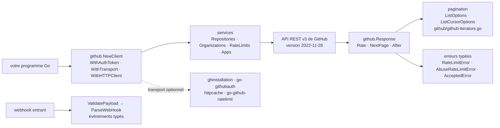

# google/go-github

> **Le client Go de l'API REST de GitHub, pour qui automatise dépôts, issues et webhooks.**

## Le problème

Parler à l'API REST de GitHub à la main, c'est réécrire à chaque projet le même socle :
construction d'URL, en-têtes d'authentification et de version d'API, décodage JSON de
structures profondes, suivi de la pagination page par page ou par curseur, et détection des
deux régimes de limitation de débit — sans quoi le programme s'arrête net au bout de quelques
centaines d'appels, avec une erreur qu'on ne sait pas distinguer d'une panne réseau.

## Ce que ça fait vraiment

go-github expose l'API REST v3 de GitHub sous la forme d'un `github.Client` découpé en
services (`client.Organizations`, `client.Repositories`, `client.RateLimits`…) qui suivent le
découpage de la documentation GitHub. Chaque méthode prend un `context.Context`, ce qui donne
annulation et délais sans code supplémentaire.

Les structures de ressources utilisent des champs *pointeurs* pour tous les champs non répétés :
on distingue un champ absent d'un champ à zéro, au prix du `new("foo")` à l'écriture.

La pagination est fournie de trois façons : les options `ListOptions` / `ListCursorOptions` avec
les informations de page dans `github.Response`, et — depuis Go 1.23 — des méthodes `*Iter`
auto-générées par `github/gen-iterators.go` dans `github/github-iterators.go`, sur lesquelles on
fait un `range`.

Les limites de débit sont typées : `RateLimitError` pour la limite primaire,
`AbuseRateLimitError` pour la secondaire, plus les options de contexte
`SleepUntilPrimaryRateLimitResetWhenRateLimited` et `BypassRateLimitCheck`. `AcceptedError`
couvre le cas des endpoints qui répondent 202 parce que la donnée n'est pas encore calculée.

Côté webhooks, la bibliothèque fournit les structures de presque tous les événements, plus
`ValidatePayload` (vérification de la signature) et `ParseWebHook` pour obtenir un événement typé
depuis une `http.Request`.

## Comment c'est branché

Aucun diagramme tiré du code n'existe pour ce dépôt : ce schéma est reconstruit depuis le seul
README.



## Essayer

```bash
go get github.com/google/go-github/v92
```

```go
import "github.com/google/go-github/v92/github"
```

```go
client, err := github.NewClient()
if err != nil {
	// Handle error.
}

// list all organizations for user "willnorris"
orgs, _, err := client.Organizations.List(context.Background(), "willnorris", nil)
```

Avec un jeton, et pour la version de tête du dépôt :

```bash
go get github.com/google/go-github/v92@master
```

```go
client, err := github.NewClient(github.WithAuthToken("... your access token ..."))
```

## Coût et pièges

- **Jeton à ta charge** : la bibliothèque est gratuite, l'accès ne l'est pas sans identité. Le
  README le dit — les clients non authentifiés ne voient que la donnée publique et ont une limite
  de débit basse. Il faut un *personal access token* ou une GitHub App.
- **Deux limites de débit, pas une** : la primaire (nombre de requêtes) et la secondaire
  (concurrence), avec des endpoints de recherche plus restrictifs. Il faut traiter les deux types
  d'erreur, ou passer par un transport dédié (`gofri/go-github-ratelimit`).
- **Les requêtes conditionnelles ne sont pas gérées** : go-github ne fait pas l'ETag lui-même, il
  est conçu pour être branché sur un `http.Transport` de cache (`bartventer/httpcache`, ou
  `bored-engineer/github-conditional-http-transport` pour les jetons de courte durée).
- **L'authentification GitHub App est hors périmètre** : elle passe par des paquets tiers
  (`bradleyfalzon/ghinstallation`, `jferrl/go-githubauth`).
- **Le chemin d'import porte le numéro de version majeure** (`.../v92/github`), et les majeures
  s'incrémentent à chaque changement incompatible de l'API GitHub : les montées de version sont
  fréquentes et touchent tous les imports.
- **Fenêtre Go étroite** : le README suit la politique de support de Go — deux dernières majeures,
  et depuis Go 1.26 la directive `go` de `go.mod` impose un minimum strict, donc N-1 par défaut.
- **Un client authentifié ne se partage pas** entre utilisateurs : le jeton est embarqué dans tous
  ses appels.

## Ce que ce n'est pas

- **Ce n'est pas un client GraphQL.** Le README renvoie explicitement vers `shurcooL/githubv4`
  pour l'API v4. go-github ne couvre que la REST v3.
- **Ce n'est pas un outil en ligne de commande** : rien à lancer, c'est un paquet Go qu'on importe.
  Ce n'est pas non plus `gh`.
- **Ce n'est pas une couche d'abstraction qui protège du service** : les fonctionnalités en
  *preview* de GitHub sont implémentées de façon agressive et explicitement non stables, et la
  version de l'API (calendaire, 2022-11-28) est un paramètre qui bouge sous la bibliothèque.

## Alternatives

| | Quand le préférer |
|---|---|
| **shurcooL/githubv4** | Recommandé par le README lui-même pour l'API GraphQL v4 : à préférer dès qu'on veut choisir les champs renvoyés et éviter les allers-retours, go-github restant le choix pour REST. |
| **migueleliasweb/go-github-mock** | Cité par le README : complément, pas concurrent — à ajouter pour tester du code qui appelle go-github sans toucher l'API réelle. |
| **gofri/go-github-ratelimit** | Cité par le README : un `http.RoundTripper` qui gère les deux limites de débit à la place du code appelant, à combiner avec `DisableRateLimitCheck`. |

Les voisins du catalogue (`avelino/awesome-go`, `JanDeDobbeleer/oh-my-posh`, `samber/lo`,
`lowlighter/metrics`) ne sont pas comparables : aucun n'est un client de l'API GitHub.

## Pour toi

À adopter dès qu'un outil interne doit lire ou écrire sur GitHub en Go : collecte de métriques de
dépôts, bot de revue, alimentation d'un catalogue, automatisation de release. C'est la voie
maintenue par Google, avec les limites de débit et la pagination déjà typées — la partie qu'on
rate toujours quand on écrit le client soi-même. À passer si ta chaîne n'est pas en Go, ou si tu as
besoin du GraphQL — dans ce cas, `shurcooL/githubv4`.
