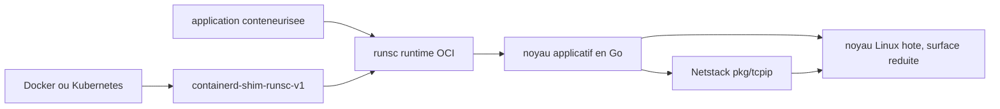

# google/gvisor

> **An application kernel written in Go that isolates a container from the host kernel, for untrusted code.**

## The problem

A container is not a sandbox. Every container on a machine shares the same host kernel, so a
single kernel vulnerability is enough to escape. Running untrusted or potentially malicious
code in a plain container is, as the README puts it, not a good idea — yet paying for a full
virtual machine per workload is often not an option either.

## What it actually does

gVisor is an application kernel: it implements a Linux-like interface itself, in a memory-safe
language (Go), and runs in userspace as an ordinary process. The application talks to gVisor
instead of the host kernel, which limits the host kernel surface the application can reach
while still exposing the features it expects. The repository ships `runsc`, an Open Container
Initiative runtime that integrates with Docker and Kubernetes, the containerd shim
`containerd-shim-runsc-v1`, and sidecar binaries that `runsc` expects to find in a
`gvisor-bin/` directory next to itself. It also carries Netstack, a userspace network stack
(`pkg/tcpip`) that can be imported on its own as a Go library. The README's own summary:
"gVisor implements Linux by way of Linux".

## How it is wired



Existing container tooling (Docker, Kubernetes through containerd) talks to the shim, which
launches `runsc` as an OCI runtime. `runsc` interposes the Go application kernel between the
application and the host kernel; networking goes through Netstack in userspace. The README
does not detail the internal architecture and points to gvisor.dev instead.

## Trying it

```sh
make release-tarball DESTINATION=bin/
sudo tar -C /usr/local/bin -xf bin/gvisor.tar.bz2
```

Specific targets, or building straight with Bazel:

```sh
make build TARGETS="//pkg/tcpip:tcpip"
bazel build -c opt //debian:gvisor-release-tar-bz2
```

Tests:

```sh
make unit-tests
make tests
```

Importing Netstack into a Go project, without `runsc`:

```sh
go get gvisor.dev/gvisor/pkg/tcpip/transport/tcp@go
```

The README does **not** document the command that actually starts a sandboxed container (no
`--runtime=runsc` here); it refers to the quick start guides on gvisor.dev.

## Cost and traps

Free, no API key, no third-party service. The cost is elsewhere: building from source requires
Linux 5.6+ and Docker 17.09.0 or greater, because bazel and the build dependencies are wrapped
in a build container; using Bazel directly is possible but the README discourages it for the
extra overhead. Only x86_64 and ARM64 are supported, other architectures "may become available
in the future". Explicit trap: the synthetic `go` branch, handy for `go get`, does **not**
produce a usable `runsc` — `runsc` needs several binaries, some not even written in Go, and
that branch is supported on a best-effort basis only. On macOS only some packages can be
tested, and bazel 8 is required.

## What it is not

The README devotes a whole section to this: it is **not** a syscall filter (seccomp-bpf),
**not** a wrapper over Linux isolation primitives (firejail, AppArmor), and **not** a VM in
the everyday sense (VirtualBox, QEMU). It is also not a tool for hardening containers against
external threats, not an integrity check, and not a way to limit a service's scope of access:
the README warns that one should still be careful about what data is made available to a
container. Finally, this repository is not the user documentation — that lives on gvisor.dev,
which makes the README alone insufficient for a production rollout.

## Alternatives

- **containerd/containerd** — named in the README through the shim: it is the host runtime
  gVisor plugs into, not a competitor; you keep containerd and swap the runtime.
- **kubearmor/KubeArmor** — policy-based runtime hardening on the host kernel: prefer it when
  the goal is constraining trusted workloads, whereas gVisor targets running untrusted code.
- anchore/grype and abiosoft/colima, offered as neighbours, are not comparable (vulnerability
  scanning, Docker VM on macOS).

## For you

Relevant as soon as you execute third-party code: user notebooks, LLM-generated tool calls,
evaluating downloaded models, multi-tenant CI. It is the option to know between "bare
container" (too weak) and "one VM per task" (too heavy), at the price of syscall compatibility
and performance you must check against your own workload.
