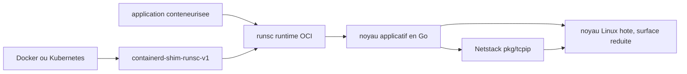

# google/gvisor

> **Un noyau applicatif en Go qui isole un conteneur du noyau hôte, pour du code non fiable.**

## Le problème

Un conteneur n'est pas un bac à sable : tous les conteneurs d'une machine partagent le même
noyau hôte, et une seule vulnérabilité de ce noyau suffit à en sortir. Faire tourner du code
non fiable ou potentiellement malveillant dans un conteneur ordinaire est donc, dit le README,
une mauvaise idée — sans pour autant vouloir payer le prix d'une VM complète.

## Ce que ça fait vraiment

gVisor est un *noyau applicatif* : il implémente lui-même une interface de type Linux, écrite
dans un langage à mémoire sûre (Go), et s'exécute en espace utilisateur comme un processus
normal. L'application appelle gVisor au lieu d'appeler le noyau hôte, ce qui réduit la surface
de noyau hôte réellement atteignable tout en laissant à l'application les fonctionnalités
qu'elle attend. Le dépôt fournit `runsc`, un runtime conforme à l'Open Container Initiative
qui s'intègre à Docker et Kubernetes, plus le shim containerd `containerd-shim-runsc-v1` et
quelques binaires annexes que `runsc` s'attend à trouver dans un répertoire `gvisor-bin/`
voisin. Il contient aussi une pile réseau en espace utilisateur, Netstack (`pkg/tcpip`),
importable séparément comme bibliothèque Go. Le README formule lui-même le principe :
« gVisor implements Linux by way of Linux ».

## Comment c'est branché



L'outillage de conteneurs habituel (Docker, Kubernetes via containerd) parle au shim, qui
lance `runsc` en tant que runtime OCI. `runsc` interpose le noyau applicatif écrit en Go entre
l'application et le noyau hôte ; le réseau passe par Netstack, en espace utilisateur. Le README
ne détaille pas l'architecture interne et renvoie pour cela à gvisor.dev.

## Essayer

```sh
make release-tarball DESTINATION=bin/
sudo tar -C /usr/local/bin -xf bin/gvisor.tar.bz2
```

Pour une cible précise, ou pour construire directement avec Bazel :

```sh
make build TARGETS="//pkg/tcpip:tcpip"
bazel build -c opt //debian:gvisor-release-tar-bz2
```

Tests :

```sh
make unit-tests
make tests
```

Pour importer Netstack dans un projet Go, sans `runsc` :

```sh
go get gvisor.dev/gvisor/pkg/tcpip/transport/tcp@go
```

Le README ne documente **pas** la commande qui lance effectivement un conteneur sandboxé
(pas de `--runtime=runsc` ici) : il renvoie aux guides de démarrage sur gvisor.dev.

## Coût et pièges

Gratuit, pas de clé d'API, pas de service tiers. Le coût est ailleurs : la construction depuis
les sources exige Linux 5.6+ et Docker 17.09.0 ou plus, car bazel et les dépendances de build
sont enveloppés dans un conteneur de build ; utiliser Bazel en direct est possible mais le
README le déconseille pour le surcoût. Seuls x86_64 et ARM64 sont pris en charge, les autres
architectures « peuvent devenir disponibles à l'avenir ». Piège explicite : la branche `go`
synthétique, pratique pour `go get`, ne produit **pas** un `runsc` utilisable — `runsc` a
besoin de plusieurs binaires dont certains ne sont pas écrits en Go, et cette branche n'est
maintenue qu'en *best effort*. Sur macOS, seuls certains paquets peuvent être testés, et il
faut bazel 8.

## Ce que ce n'est pas

Le README consacre une section entière à le dire : ce n'est **pas** un filtre d'appels système
(seccomp-bpf), **pas** un emballage des primitives d'isolation Linux (firejail, AppArmor), et
**pas** une VM au sens courant (VirtualBox, QEMU). Ce n'est pas non plus un outil de
durcissement de conteneurs contre des menaces externes, ni un contrôle d'intégrité, ni un
limiteur de portée d'accès d'un service : le README prévient qu'il faut de toute façon rester
attentif aux données qu'on rend accessibles au conteneur. Enfin, ce dépôt n'est pas la
documentation utilisateur — elle vit sur gvisor.dev, ce qui rend le README seul insuffisant
pour une mise en production.

## Alternatives

- **containerd/containerd** — nommé dans le README via le shim : c'est le runtime hôte auquel
  gVisor se greffe, pas un concurrent ; on garde containerd et on change de runtime.
- **kubearmor/KubeArmor** — durcissement d'exécution à base de politiques sur le noyau hôte :
  à préférer si le besoin est de contraindre des charges de confiance, là où gVisor vise
  l'exécution de code non fiable.
- anchore/grype et abiosoft/colima, proposés en voisins, ne sont pas comparables (analyse de
  vulnérabilités, VM Docker sur macOS).

## Pour toi

Pertinent dès qu'on exécute du code tiers : notebooks d'utilisateurs, exécution d'outils
générés par un LLM, évaluation de modèles téléchargés, CI multi-tenant. C'est l'option à
connaître entre « conteneur nu » (trop faible) et « VM par tâche » (trop lourde), au prix
d'une compatibilité d'appels système et de performances à vérifier sur ta charge réelle.
