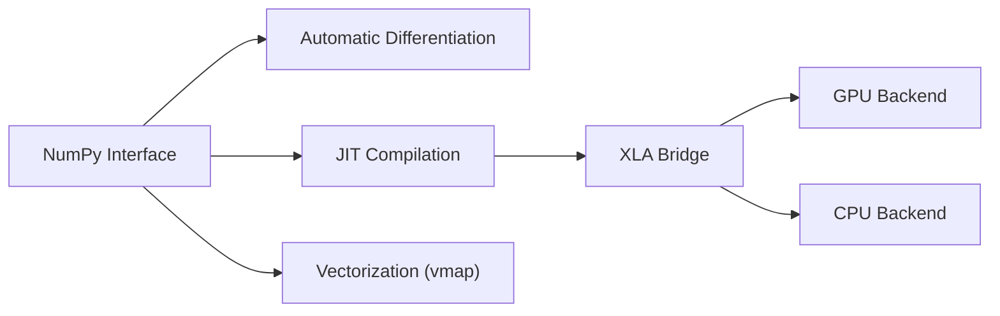

# google/jax

> Bibliothèque Python de calcul numérique avec différentiation automatique et compilation XLA, pour la recherche et le ML à grande échelle.

## Le problème
Écrire du calcul NumPy différentiable, compilé et parallélisé sur GPU/TPU exige d'ordinaire des cadres lourds.

## Ce que ça fait vraiment
Offre une API proche de NumPy et des transformations composables : `grad` (dérivées de tout ordre, mode direct ou inverse), `jit` (compilation XLA), `vmap` (vectorisation) et le partitionnement multi-appareils (automatique, explicite ou manuel par appareil). Fonctionne sur CPU, GPU NVIDIA/AMD, TPU. Le README l'annonce comme projet de recherche, pas un produit officiel Google, avec des « arêtes vives ».

## Comment c'est branché


## Essayer
```bash
pip install -U jax
pip install -U "jax[cuda13]"
pip install -U "jax[tpu]"
```

## Coût et pièges
Gratuit ; les wheels dépendent de la plateforme (CUDA 13, TPU, ROCm). Le README renvoie à une page de « gotchas » : fonctions pures et contraintes de flot de contrôle sous `jit`. Licence non renseignée au catalogue.

## Ce que ce n'est pas
Pas un framework de réseaux de neurones : le README ne parle pas de couches (Flax et Optax sont des bibliothèques distinctes). Différent de PyTorch par ses fonctions pures.

## Alternatives
Aucune alternative nommée dans le README.

## Pour toi
Adopter si tu fais de la recherche ou du calcul haute performance différentiable, notamment sur TPU ; pour du deep learning courant, PyTorch reste plus direct.
