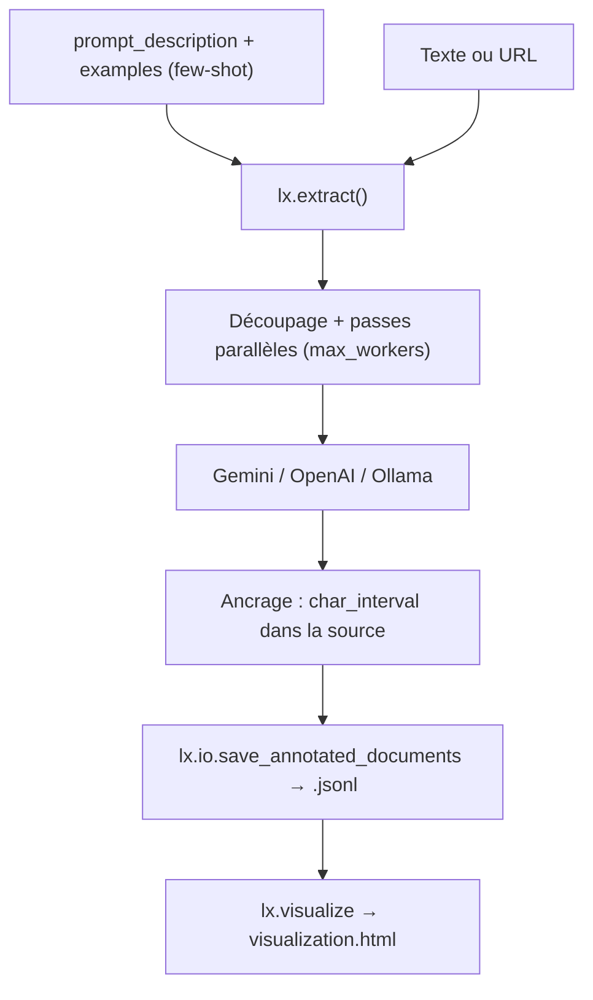

# google/langextract

> Bibliothèque Python qui extrait des données structurées d'un texte, chaque extraction ancrée.

## Le problème
Un LLM qui extrait des entités d'un compte rendu invente des formulations et ne dit pas où il a
trouvé quoi — impossible de vérifier sans relire le document entier.

## Ce que ça fait vraiment
Associe chaque extraction à sa position exacte dans le texte source, ce qui permet de la surligner
et de la vérifier. Les extractions non localisables ont `char_interval = None` et se filtrent.
Impose un schéma de sortie cohérent tiré des exemples few-shot, avec génération contrôlée sur les
modèles qui la supportent ; `output_schema` permet en plus des contraintes (énumérations) sur Gemini
et OpenAI. Découpe les longs documents, les traite en parallèle et repasse plusieurs fois pour
améliorer le rappel — le README montre un roman entier traité depuis une URL Gutenberg.
Génère un fichier HTML interactif autonome pour relire des milliers d'entités dans leur contexte.

## Comment c'est branché


## Essayer
```bash
pip install langextract
export LANGEXTRACT_API_KEY="your-api-key-here"
docker build -t langextract .
docker run --rm -e LANGEXTRACT_API_KEY="your-api-key" langextract python your_script.py
pytest tests
```

## Coût et pièges
Les modèles hébergés demandent une clé ; le README recommande un palier Gemini payant pour le
volume, à cause des limites de débit. Les modèles Gemini ont des dates de retrait, à surveiller.
Ollama évite la clé mais pas le matériel, et ne supporte pas `output_schema`.
Les exemples pilotent tout le comportement : un `extraction_text` non verbatim déclenche un
avertissement d'alignement qu'il faut traiter.

## Ce que ce n'est pas
Ce n'est pas un produit Google officiellement supporté, le README le dit. Ce n'est pas un outil
médical : l'exemple médicaments porte un avertissement explicite. Ce n'est pas un système
d'annotation : il extrait, il ne gère ni la revue humaine ni le cycle de correction.

## Alternatives
Aucune alternative nommée dans le README.

## Pour toi
L'outil à sortir dès qu'une extraction doit être vérifiable ligne par ligne — comptes rendus, rapports.
