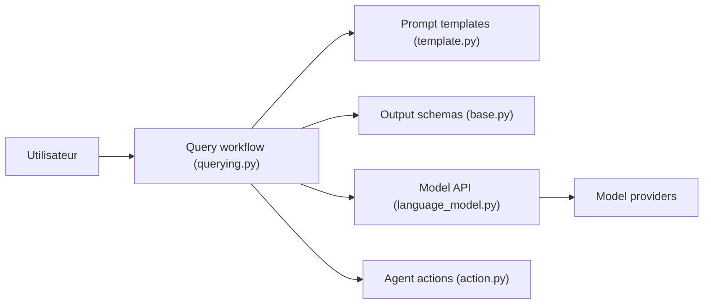

# google/langfun

> Bibliothèque Python, fondée sur PyGlove, pour interroger des LLM avec des objets typés plutôt que du texte.

## Le problème
Extraire des données structurées d'un LLM exige de bricoler des prompts et d'analyser des réponses libres.

## Ce que ça fait vraiment
`lf.query` prend un gabarit de prompt, un schéma d'objets PyGlove et un modèle, puis renvoie un objet typé. Gère les entrées multimodales, plusieurs fournisseurs (Gemini, GPT, Claude, Llama), un cadre d'évaluation, des actions d'agent, des clients MCP et des environnements sandbox. Le README indique que ce n'est pas un produit officiellement supporté par Google.

## Comment c'est branché


## Essayer
```bash
pip install langfun
pip install langfun[all]
```

## Coût et pièges
Gratuit ; appels de modèles facturés par le fournisseur choisi. Il faut adopter PyGlove, un modèle de programmation propre.

## Ce que ce n'est pas
Pas un framework d'orchestration complet. Les mots du README sur la simplicité ne sont pas mesurés.

## Alternatives
Aucune alternative nommée dans le README.

## Pour toi
À surveiller : intéressant pour la sortie structurée typée et l'évaluation, mais PyGlove ajoute une courbe d'apprentissage et le support n'est pas officiel.

