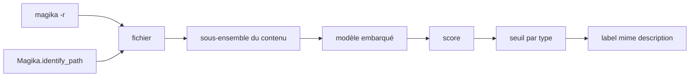

# google/magika

> Détecteur de type de fichier par réseau de neurones, précis sur plus de 200 types de contenu.

## Le problème
`file` et les signatures magiques se trompent souvent, surtout sur les contenus textuels et le code.
Un mauvais type en entrée de pipeline, c'est un parseur qui plante ou un fichier mal routé.

## Ce que ça fait vraiment
Un modèle de quelques Mo, entraîné sur ~100M de fichiers, ~99 % de précision et rappel moyens sur leur jeu de test.
Environ 5 ms par fichier après chargement du modèle, même sur un seul CPU, quasi indépendant de la taille du fichier.
Un seuil par type de contenu décide s'il faut faire confiance à la prédiction ou renvoyer une étiquette générique.
Trois modes de tolérance : `high-confidence`, `medium-confidence`, `best-guess`.

## Comment c'est branché


## Essayer
```bash
pipx install magika
magika -r * | head
magika ./tests_data/basic/python/code.py --json
cat tests_data/basic/ini/doc.ini | magika -
```
Aussi `brew install magika`, `cargo install --locked magika-cli`, `pip install magika`, `npm install magika`.

## Coût et pièges
Rien à payer ni à héberger : le modèle est embarqué et l'inférence est locale.
Le seuil peut renvoyer « Generic text document » ou « Unknown binary data » — c'est un refus, pas une erreur.

## Ce que ce n'est pas
Pas un projet officiel Google : le README décline toute garantie de qualité ou d'adéquation.
Pas un antivirus : il identifie un type de contenu, il ne juge pas de la dangerosité.
Pas une certitude : ~99 % en moyenne veut dire des erreurs, d'où les modes de confiance.

## Alternatives
Aucune nommée dans le README.

## Pour toi
À mettre en entrée de tout pipeline d'ingestion documentaire : 5 ms pour éviter un parseur mal choisi.
