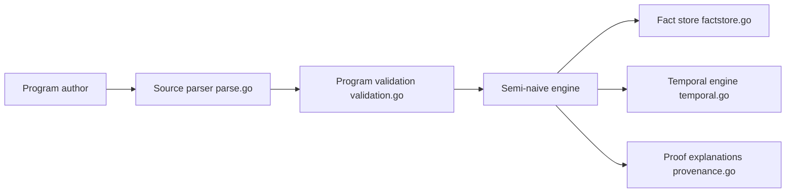

# google/mangle

> Langage de programmation déductive (Datalog étendu) en Go, embarquable, pour raisonner sur des données hétérogènes.

## Le problème
Croiser des sources de données et modéliser des connaissances avec des règles récursives est maladroit en SQL.

## Ce que ça fait vraiment
Implémentation en Go d'un Datalog avec agrégation, appels de fonctions, typage optionnel et raisonnement temporel (faits avec intervalles). Pipeline : analyse du source, validation et analyse des règles, évaluation ascendante semi-naïve contre un magasin de faits, requêtes et explications de preuve. Un interpréteur interactif existe. La terminaison n'est plus garantie avec les extensions.

## Comment c'est branché


## Essayer
```bash
go get -t ./...
go build ./...
go test ./...
```

## Coût et pièges
Go requis, plus Java et ANTLR 4.13.2 seulement pour régénérer le parseur. Le dépôt est hébergé sur Codeberg et miroir GitHub.

## Ce que ce n'est pas
N'est pas, et n'a jamais été, un produit Google officiellement supporté (précisé dans le README). Ce n'est pas une base de données serveur : une bibliothèque à embarquer.

## Alternatives
- Logica : traduit du Datalog non récursif en SQL.

## Pour toi
À surveiller : pertinent pour du raisonnement symbolique ou un graphe de connaissances, mais niche ; sans lien direct avec un pipeline ML classique.

