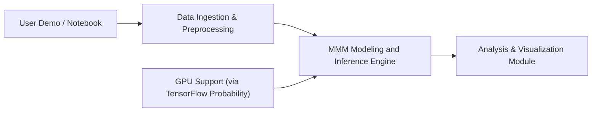

# google/meridian

> Framework bayésien de modélisation du mix marketing pour mesurer le retour de chaque canal, à faire tourner chez soi.

## Le problème
Savoir quel canal publicitaire a réellement fait vendre, et où réallouer le budget, sans données individuelles ni cookies.

## Ce que ça fait vraiment
Estime l'effet des canaux sur un KPI par inférence causale bayésienne (échantillonneur NUTS, TensorFlow Probability), sur données agrégées par zone géographique ou nationales. Calcule ROI, optimise le budget, permet de calibrer avec des expériences et d'optimiser la fréquence avec les données de reach & frequency. Rapports HTML par gabarits Jinja2. Guide de migration depuis LightweightMMM.

## Comment c'est branché


## Essayer
```sh
pip install --upgrade google-meridian[and-cuda]
pip install --upgrade google-meridian
```
Le README renvoie au Colab « Getting Started » avec données d'exemple.

## Coût et pièges
Python 3.11–3.13 ; au moins un GPU recommandé (testé sur T4 avec 16 Go) car l'échantillonnage MCMC est lourd. Pas de GPU officiel sur macOS.

## Ce que ce n'est pas
Pas un outil d'attribution au niveau utilisateur. Les résultats dépendent de la qualité des données agrégées.

## Alternatives
LightweightMMM, dont le README fournit le guide de migration.

## Pour toi
À adopter : cadre de modélisation bayésienne documenté, maintenu par Google, directement utile à un data scientist en marketing analytics.

