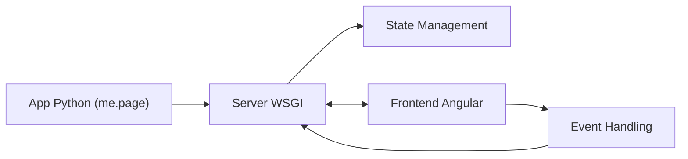

# google/mesop

> Framework Python pour construire des démos et applications web internes sans écrire de JavaScript.

## Le problème
Bâtir une interface web pour une démo ML oblige à toucher HTML, CSS et JavaScript.

## Ce que ça fait vraiment
On écrit l'interface en fonctions Python (`@me.page`), avec composants prêts à l'emploi, rechargement à chaud qui préserve l'état et typage strict. Le code décrit un frontend Angular, un serveur WSGI, une gestion d'état de session et une politique de sécurité. Un composant `mesop.labs` fournit des exemples type texte-vers-texte.

## Comment c'est branché


## Essayer
```bash
pip install mesop
mesop main.py
```

## Coût et pièges
Gratuit. **Alerte majeure** : le README annonce que Mesop n'est plus maintenu à partir du 30 septembre 2026 (plus de correctifs ni de support). « Pas un produit Google officiellement supporté. »

## Ce que ce n'est pas
Pas un framework pérenne : fin de maintenance annoncée. Ne remplace pas un vrai frontend.

## Alternatives
Aucune nommée dans le README.

## Pour toi
À ignorer pour un nouveau projet : la maintenance s'arrête le lendemain de cette lecture, mieux vaut un outil vivant pour tes démos.

