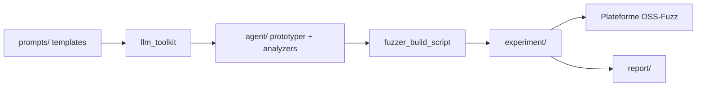

# google/oss-fuzz-gen

> Cadre qui génère des cibles de fuzzing par LLM pour projets C, C++, Java et Python, et les évalue via OSS-Fuzz.

## Le problème
Écrire à la main des harnais de fuzzing pour des centaines de bibliothèques laisse du code non couvert.

## Ce que ça fait vraiment
Il fait produire des cibles de fuzzing par des modèles (Vertex AI, Gemini, GPT-4 et dérivés, Azure), les compile et les évalue sur quatre critères : compilabilité, plantages, couverture, écart de couverture face aux cibles humaines. L'équipe rapporte 30 failles trouvées (dont CVE-2024-9143 dans OpenSSL) et des gains de couverture par projet. Des agents individuels peuvent être exécutés seuls.

## Comment c'est branché

## Essayer
Aucune commande documentée dans le README : il renvoie au guide d'usage détaillé et à la documentation d'exécution des agents.

## Coût et pièges
Les appels LLM sont à ta charge (Vertex AI ou OpenAI). Les rapports complets ne sont pas publics, car ils peuvent contenir des failles non divulguées. La liste des modèles du README date (code-bison, GPT-3.5).

## Ce que ce n'est pas
Pas un outil clé en main : c'est un cadre de recherche adossé à OSS-Fuzz. Le dernier push date de mars 2026.

## Alternatives
Aucune alternative nommée dans le README.

## Pour toi
À surveiller : cas d'école d'évaluation de code généré par LLM avec des métriques objectives, à lire pour ses méthodes.
