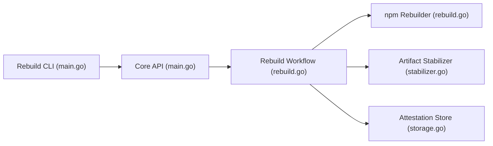

# google/oss-rebuild

> Reconstruit des paquets npm, PyPI et Crates.io et publie des attestations de build, pour sécuriser la chaîne logistique.

## Le problème
Un paquet publié peut différer de son code source sans que personne le détecte, comme dans les compromissions Solarwinds ou Codecov.

## Ce que ça fait vraiment
Analyse les métadonnées et artefacts publiés, refait le build, compare avec la version amont et publie une attestation signée si cela concorde. La CLI `oss-rebuild` consulte les données (`get`, `list`) et peut sortir le Dockerfile. Seuls les paquets les plus populaires sont reconstruits. Le graphe ajoute Debian, Maven et un agent assisté par IA.

## Comment c'est branché


## Essayer
```bash
go install github.com/google/oss-rebuild/cmd/oss-rebuild@latest
oss-rebuild get pypi absl-py 2.0.0
oss-rebuild get pypi absl-py 2.0.0 --output=payload
oss-rebuild list pypi absl-py
gcloud auth application-default login
```

## Coût et pièges
Les identifiants ADC Google Cloud sont nécessaires pour vérifier les signatures (clé KMS publique), sauf avec `--verify=false`. Couverture partielle des paquets.

## Ce que ce n'est pas
Pas un produit officiellement supporté par Google, selon le README. Ne garantit pas qu'un paquet est sans faille, seulement qu'il correspond à sa reconstruction.

## Alternatives
reproducible-central (Java, Kotlin), kpcyrd/rebuilderd (ordonnanceur multi-distributions).

## Pour toi
À surveiller : utile pour vérifier les dépendances PyPI de tes pipelines ML, mais couverture limitée aux paquets populaires.

