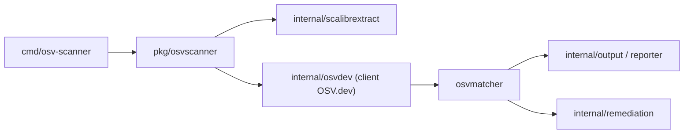

# google/osv-scanner

> Scanneur en ligne de commande qui relie les dépendances d'un projet aux vulnérabilités connues d'OSV.dev.

## Le problème
Savoir quelles dépendances, images de conteneur ou paquets système d'un projet sont touchés par une faille publiée.

## Ce que ça fait vraiment
Un binaire Go analyse un répertoire (`package.json`, `go.mod`, `pom.xml`…) ou une image de conteneur, puis interroge l'API OSV.dev. Il peut faire une analyse d'appel pour limiter les faux positifs, fonctionner hors ligne avec une base locale, et proposer des mises à jour (`fix`, expérimental) pour npm et Maven. Il repose sur la bibliothèque OSV-Scalibr.

## Comment c'est branché


## Essayer
```bash
go install github.com/google/osv-scanner/v2/cmd/osv-scanner@latest
osv-scanner scan source -r /path/to/your/dir
osv-scanner scan image my-image-name:tag
osv-scanner --offline --download-offline-databases ./path/to/your/dir
```

## Coût et pièges
Gratuit. En mode connecté, noms, versions, écosystèmes et empreintes de fichiers partent vers OSV.dev et deps.dev ; `--offline` évite cela. La commande `fix` peut exécuter des scripts du gestionnaire de paquets : à ne pas lancer sur un projet non fiable.

## Ce que ce n'est pas
Pas un analyseur de code source : il ne trouve que des failles déjà publiées. La remédiation ne couvre que `package-lock.json`, `package.json` et `pom.xml`.

## Alternatives
Aucune alternative nommée dans le README.

## Pour toi
À adopter : un contrôle de dépendances gratuit et scriptable convient aux images Docker et aux `requirements` de projets ML, avec un mode hors ligne pour les environnements fermés.

