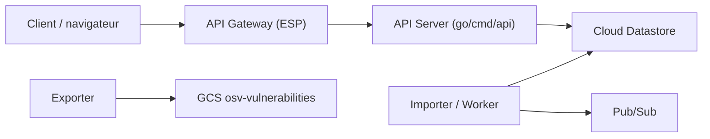

# google/osv.dev

> Base ouverte de vulnérabilités logicielles, avec API, interface web et exports de données.

## Le problème
Savoir si les dépendances d'un projet ont des failles connues, avec des identifiants et des versions comparables entre écosystèmes.

## Ce que ça fait vraiment
Ce dépôt contient le code qui fait tourner osv.dev sur GCP : API (Go), site web, importeur, exporteur, indexeur de versions, workers Python (oss_fuzz, vanir), convertisseurs de flux (NVD, Alpine, Debian), Terraform et Cloud Deploy. On consomme le service par l'API, l'interface ou le dump (`gs://osv-vulnerabilities`). Le scanner de dépendances vit dans un autre dépôt. Des outils tiers l'exploitent : Trivy, pip-audit, Renovate, Dependency-Track.

## Comment c'est branché


## Essayer
```bash
git submodule update --init --recursive
```
Pour l'usage courant, le README renvoie vers la documentation de l'API et le dump GCS, sans commande dans le README.

## Coût et pièges
Gratuit côté consommateur. Auto-héberger le service est lourd (GCP, Datastore, Pub/Sub). Les outils tiers ne sont ni soutenus ni approuvés par les mainteneurs.

## Ce que ce n'est pas
Pas un scanner : il fournit les données ; le scanner est un dépôt séparé.

## Alternatives
Le README cite Trivy, pip-audit, Dependency-Track et Renovate comme outils qui s'appuient sur OSV.

## Pour toi
Adopter en tant que source de données : brancher l'API ou le dump dans le contrôle des dépendances Python/Docker d'un pipeline MLOps ; ne pas héberger ce dépôt soi-même.
