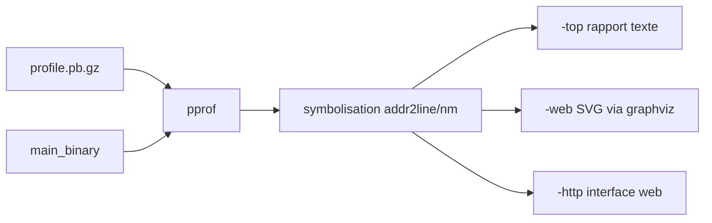

# google/pprof

> Visualiseur et analyseur de profils d'exécution au format profile.proto, texte ou graphique.

## Le problème
Un profil brut de callstacks échantillonnés est illisible : sans agrégation ni symbolisation, impossible de savoir où passe le temps.

## Ce que ça fait vraiment
Lit des échantillons au format profile.proto depuis un fichier local ou une URL HTTP.
Génère des rapports texte triés par « hotness », des graphes SVG, ou une interface web interactive.
Agrège ou compare plusieurs profils du même type.
Symbolise les adresses machine via addr2line et nm quand les binaires sont fournis.

## Comment c'est branché


## Essayer
```bash
go install github.com/google/pprof@latest
pprof -top [main_binary] profile.pb.gz
pprof -web [main_binary] profile.pb.gz
pprof -http=[host]:[port] [main_binary] profile.pb.gz
```

## Coût et pièges
Gratuit. Il faut un kit de développement Go pour l'installer ; Graphviz est optionnel mais nécessaire aux visualisations graphiques. Sur Windows, le désassemblage exige un binaire construit avec `go build -buildmode=exe` et LLVM ou GCC installé.

## Ce que ce n'est pas
Pas un profileur : il lit des profils produits ailleurs, il ne les collecte pas. Pas un produit officiel Google, le README le dit explicitement. Les fichiers `perf.data` de Linux perf nécessitent le convertisseur `perf_to_profile` d'un autre paquet.

## Alternatives
Aucune alternative nommée ; le README cite `perf_data_converter` comme complément, pas comme concurrent.

## Pour toi
Le standard de fait pour profiler du Go, et lisible pour n'importe quel profil converti en profile.proto.
