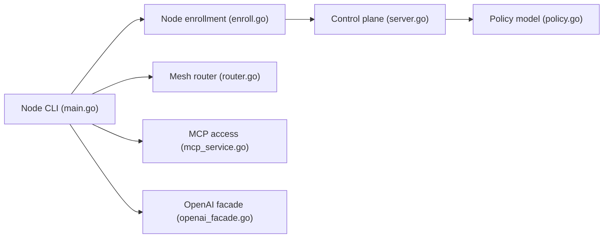

# google/sam

> Réseau privé pour agents IA : publication d'outils et de modèles, découverte et identité vérifiable.

## Le problème
Des agents répartis (portables, conteneurs, clusters, derrière NAT) ne se trouvent pas et ne s'authentifient pas facilement entre eux.

## Ce que ça fait vraiment
Un nœud `sam-node` tourne près de l'agent, publie ses services locaux, découvre ceux des autres et expose un serveur MCP local plus une API compatible OpenAI. Un plan de contrôle valide l'identité (OIDC ou jeton) et émet des identifiants courts ; un routeur relaie quand la connexion directe échoue. Rien n'est joignable par défaut.

## Comment c'est branché


## Essayer
```bash
curl -sL https://sam-mesh.dev/install.sh | bash
sam-node join https://bananas.sam-mesh.dev
sam-node run --daemonize
sam-node skill install
```

## Coût et pièges
Gratuit. Le réseau d'essai partagé n'a aucune promesse de disponibilité. Pré-1.0 ; agents en bac à sable et appli mobile en préversion. Piper un script distant dans bash demande de la prudence.

## Ce que ce n'est pas
Pas un framework d'agents : il relie des agents existants. Le README ne détaille pas les performances.

## Alternatives
Aucune alternative nommée dans le README.

## Pour toi
À surveiller : idée solide pour relier des agents avec des droits explicites, mais pré-1.0 ; teste sur ton propre mesh avant tout usage réel.

