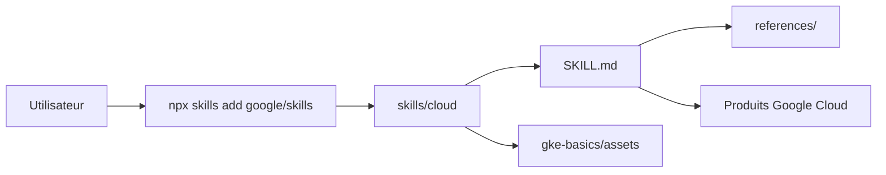

# google/skills

> Catalogue de skills d'agents, publié par Google, pour travailler avec Google Cloud, Firebase, Ads et Gemini.

## Le problème
Un agent de code ne connaît pas les bonnes pratiques à jour de chaque produit Google Cloud. Il improvise des commandes gcloud, des manifestes GKE ou des requêtes BigQuery approximatifs.

## Ce que ça fait vraiment
Le dépôt ne contient pas de programme : ce sont des dossiers `skills/cloud/<nom>/` avec un `SKILL.md` et des sous-documents `references/`. Chaque skill est installable à la carte. Le catalogue couvre GKE, BigQuery, AlloyDB, Cloud Run, Gemini API, sécurité/IAM, SecOps, Ads et le Well-Architected Framework. Seul `gke-basics` embarque des manifestes YAML d'exemple.

## Comment c'est branché


## Essayer
```bash
npx skills add google/skills
claude plugin marketplace add google/skills
claude plugin install @google-plugins
```

## Coût et pièges
Les skills sont gratuits, mais ce qu'ils déclenchent (GKE, BigQuery, Gemini) est facturé sur ton compte Google Cloud. Le catalogue est très large : n'installer que ce qui sert.

## Ce que ce n'est pas
Ce n'est pas une bibliothèque ni un serveur : aucune exécution, seulement des instructions pour l'agent. Ce n'est pas non plus vendor-neutral : tout est centré sur les produits Google.

## Alternatives
Le README n'en cite aucune ; il mentionne seulement des listes complémentaires (skills ADK, Android, Flutter, Maps, Firestore).

## Pour toi
À surveiller : utile si tu travailles sur BigQuery, Vertex/Agent Platform ou GKE avec un agent de code, sans intérêt si ta stack n'est pas sur Google Cloud.

