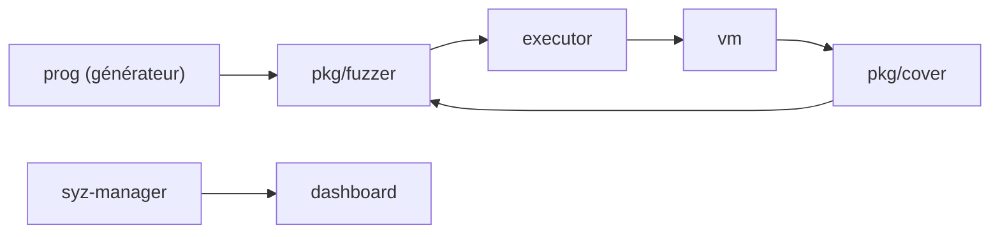

# google/syzkaller

> Fuzzer de noyaux d'OS guidé par la couverture, pour chercheurs et mainteneurs de noyaux.

## Le problème
Les bugs de noyau (Linux, BSD, Windows…) sont difficiles à trouver à la main.

## Ce que ça fait vraiment
Génère des programmes d'appels système (`prog`, descriptions dans `sys`), les exécute dans des machines virtuelles via un exécuteur, collecte la couverture et les plantages, et réinjecte le retour dans la génération. Modules : syz-manager, syz-hub, dashboard, syz-cluster, bases de couverture. Le README renvoie à la documentation pour l'installation et l'usage.

## Comment c'est branché

## Essayer
Aucune commande documentée dans le README : voir la documentation d'installation liée.

## Coût et pièges
Gratuit, mais lourd : VM, noyau instrumenté, temps de calcul. Documentation surtout centrée sur Linux. 639 issues ouvertes.

## Ce que ce n'est pas
Pas un scanner de sécurité applicatif ; « produit non officiel de Google ».

## Alternatives
Aucune nommée dans le README.

## Pour toi
À ignorer : fuzzing de noyau, hors périmètre data/IA/MLOps.

