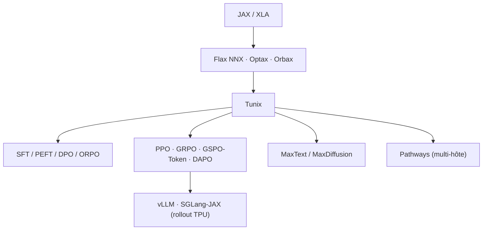

# google/tunix

> Bibliothèque JAX de post-entraînement de LLM, taillée pour les TPU.

## Le problème
Post-entraîner un LLM en JAX suppose de recoller soi-même SFT, RL, rollout d'inférence et
checkpointing multi-hôte.

## Ce que ça fait vraiment
Couvre le fine-tuning supervisé (poids complets, PEFT, DPO, ORPO), l'apprentissage par
renforcement (PPO, GRPO, GSPO-Token, DAPO, Dr.GRPO) et le RL agentique (usage d'outils
multi-tours, rollout asynchrone pour la collecte de trajectoires, regroupement par lots).
S'appuie sur Flax NNX, Optax, Orbax, s'intègre nativement à vLLM et SGLang-JAX pour le rollout
sur TPU et à MaxText pour les noyaux performants. Entraînement distribué multi-hôte via
Pathways annoncé jusqu'à des milliers d'accélérateurs, avec checkpointing et tolérance aux
pannes. Statut affiché : « V2 Release », développement actif.

## Comment c'est branché


## Essayer
```bash
# Deux chemins d'installation TPU documentés, exclusifs l'un de l'autre :
# 1) image Docker construite depuis Dockerfile (requirements/requirements.txt
#    et requirements/special_requirements.txt épinglés)
# 2) scripts/install_tunix_vllm_requirement.sh sur VM TPU ou machine de dev
```
Le README ne donne pas d'autre commande : il renvoie à la page Installation et aux notebooks.

## Coût et pièges
Gratuit, mais orienté TPU : les gains annoncés sont sur TPU, et l'intégration vLLM/
`tpu-inference` a ses propres dépendances épinglées. Si tu construis l'image Docker, ne lance
pas en plus le script d'installation dans le conteneur.

## Ce que ce n'est pas
Ce n'est pas un framework de pré-entraînement ni une bibliothèque de modèles : c'est la couche
intermédiaire entre les utilitaires JAX et les modèles optimisés type MaxText. Ce n'est pas
non plus du PyTorch — tout l'écosystème est JAX.

## Alternatives
- GRL (Hao AI Lab, UCSD) : framework de RL multi-tours sur jeux, partenaire plutôt que
  concurrent, intégré à Tunix pour le support TPU.

## Pour toi
Intéressant seulement si tu as accès à des TPU et que ton stack est déjà JAX.
