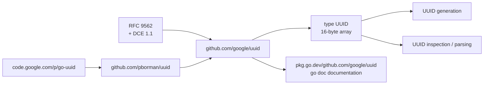

# google/uuid

> **The reference Go package for generating and inspecting UUIDs as defined by RFC 9562.**

## The problem

Without a dedicated package, every Go service rolls its own identifiers: time plus randomness
concatenated by hand, formatting improvised, parsing left lax. The variants and versions defined
by RFC 9562 and DCE 1.1 end up approximated, and two services in the same system stop agreeing on
what counts as a valid identifier.

## What it actually does

- Generates and inspects UUIDs per [RFC 9562](https://datatracker.ietf.org/doc/html/rfc9562) and
  DCE 1.1 (Authentication and Security Services) — that is the entire advertised scope.
- Represents a UUID as a **16-byte array** rather than a byte slice; this is the stated difference
  from the earlier packages.
- Derives from `github.com/pborman/uuid`, previously named `code.google.com/p/go-uuid`.
- Accepted consequence of the fixed-size array: the package **cannot represent an invalid UUID**
  as distinct from the NIL UUID. An array is always of a legal length.
- The function-level detail is not in the README, which points to the `go doc` documentation
  published on pkg.go.dev.

## How it is wired

No code-derived diagram exists for this repository; the graph below is reconstructed from the
README alone, which names no source file.



## Trying it

```sh
go get github.com/google/uuid
```

That is the only command in the README. No code sample, no function call and no test command are
documented there; for those the README refers to https://pkg.go.dev/github.com/google/uuid.

## Cost and gotchas

- **No cost**: no API key, no third-party service, no account, no GPU, no notable RAM. A pure Go
  dependency fetched with `go get`.
- **Prerequisite**: a Go toolchain. The minimum Go version is not documented in the README.
- **Migration gotcha**: coming from `pborman/uuid` or `code.google.com/p/go-uuid`, the move from
  slice to 16-byte array is not neutral — code relying on a variable length, or on an "invalid"
  UUID value, has to be revisited.
- **BSD-3-Clause licence**: permissive, with a non-endorsement clause; no reciprocity obligation.

## What it is not

- **Not a general-purpose sortable or time-ordered ID generator**: the package stays within what
  RFC 9562 and DCE 1.1 define, and nothing beyond.
- **Not a lenient validator**: because a UUID is a 16-byte array, the library cannot carry an
  "invalid UUID" state separate from the NIL UUID. Callers must handle the parse error where it
  happens.
- **Not a README you can use as documentation**: 840 characters, zero examples. Everything of
  substance lives on pkg.go.dev, outside the repository.

## Alternatives

| | When to prefer it |
|---|---|
| **pborman/uuid** | Named in the README as the package this one derives from. Prefer it when existing code depends on the byte-slice representation and on telling an invalid UUID apart from the NIL UUID. |
| **code.google.com/p/go-uuid** | The former name of `pborman/uuid`, cited by the README to establish lineage. Of no use for a new project: the host is long gone. |

No neighbours were supplied with this repository; beyond these two ancestors named by the README,
there is no comparable alternative in the catalogue.

## For you

Unglamorous, but it is the brick every Go service ends up pulling in: request tracing, training-job
keys, artefact identifiers in a model registry. Permissive licence, Google stewardship, a tiny and
stable surface — adopt it without deliberation as soon as a piece of the platform is written in Go,
and ignore it otherwise, since the package is useless outside that ecosystem.
