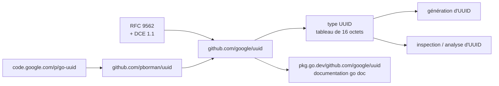

# google/uuid

> **Le paquet Go de référence pour fabriquer et relire des UUID conformes à la RFC 9562.**

## Le problème

Sans paquet dédié, chaque service Go réécrit sa propre génération d'identifiants : concaténation
de temps et d'aléa, formatage à la main, analyse laxiste des chaînes reçues. Les variantes et
versions d'UUID définies par la RFC 9562 et DCE 1.1 sont alors approximées, et deux services du
même système finissent par ne pas s'accorder sur ce qu'est un identifiant valide.

## Ce que ça fait vraiment

- Génère et inspecte des UUID selon la [RFC 9562](https://datatracker.ietf.org/doc/html/rfc9562)
  et DCE 1.1 (Authentication and Security Services) — c'est la seule fonction annoncée.
- Représente un UUID par un **tableau de 16 octets**, et non par une tranche (`slice`) d'octets :
  c'est la différence revendiquée avec les paquets antérieurs.
- Ce paquet est une reprise de `github.com/pborman/uuid`, lui-même anciennement
  `code.google.com/p/go-uuid`.
- Conséquence assumée du tableau de taille fixe : on **perd la capacité de représenter un UUID
  invalide**, distinct de l'UUID NIL. Un tableau est toujours d'une longueur légale.
- Le détail des fonctions n'est pas dans le README : il renvoie à la documentation `go doc`
  publiée sur pkg.go.dev.

## Comment c'est branché

Aucun diagramme tiré du code n'existe pour ce dépôt ; ce schéma est reconstruit depuis le seul
README, qui ne nomme aucun fichier source.



## Essayer

```sh
go get github.com/google/uuid
```

C'est la seule commande du README. Aucun exemple de code, aucun appel de fonction et aucune
commande de test n'y sont documentés : le README renvoie pour cela à
https://pkg.go.dev/github.com/google/uuid.

## Coût et pièges

- **Aucun coût** : pas de clé d'API, pas de service tiers, pas de compte à créer, pas de GPU ni
  de RAM particulière. Une dépendance Go pure récupérée par `go get`.
- **Prérequis** : une chaîne d'outils Go. La version minimale de Go n'est pas documentée dans le
  README.
- **Piège de migration** : si le code vient de `pborman/uuid` ou de `code.google.com/p/go-uuid`,
  le passage du `slice` au tableau de 16 octets n'est pas neutre — le code qui s'appuyait sur une
  longueur variable ou sur un UUID « invalide » doit être revu.
- **Licence BSD-3-Clause** : permissive, avec clause de non-endossement ; aucune obligation de
  réciprocité.

## Ce que ce n'est pas

- **Ce n'est pas un générateur d'identifiants triables ou ordonnés par le temps en général** : le
  paquet s'en tient à ce que définissent la RFC 9562 et DCE 1.1, rien de plus.
- **Ce n'est pas un validateur permissif** : puisqu'un UUID est un tableau de 16 octets, la
  bibliothèque ne peut pas porter l'état « UUID invalide » distinct de l'UUID NIL. Le code appelant
  doit gérer l'erreur d'analyse au moment où elle survient.
- **Ce n'est pas un README utilisable comme documentation** : 840 caractères, aucun exemple. Toute
  la matière est sur pkg.go.dev, hors du dépôt.

## Alternatives

| | Quand le préférer |
|---|---|
| **pborman/uuid** | Nommé dans le README comme le paquet dont celui-ci est issu. À préférer si le code existant dépend de la représentation en tranche d'octets et de la distinction entre UUID invalide et UUID NIL. |
| **code.google.com/p/go-uuid** | Ancien nom de `pborman/uuid`, cité par le README pour situer la filiation. Sans intérêt pour un nouveau projet : l'hébergement est éteint. |

Aucun voisin n'a été fourni avec ce dépôt ; en dehors de ces deux ancêtres nommés par le README,
aucune alternative comparable dans le catalogue.

## Pour toi

Peu spectaculaire, mais c'est la brique que tout service Go finit par tirer : traçage de requêtes,
clés de jobs d'entraînement, identifiants d'artefacts dans un registre de modèles. Licence
permissive, gouvernance Google, périmètre minuscule et stable — à adopter sans réfléchir dès qu'un
composant de la plateforme est écrit en Go, et à ignorer autrement, puisque le paquet ne sert à
rien hors de cet écosystème.
