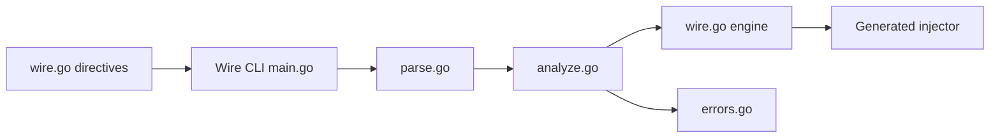

# google/wire

> Générateur de code Go qui câble les dépendances à la compilation, sans réflexion.

## Le problème
Initialiser à la main un graphe de composants Go est répétitif ; les conteneurs d'injection à l'exécution utilisent la réflexion et l'état global.

## Ce que ça fait vraiment
Le développeur déclare des fournisseurs (fonctions) et un gabarit d'injecteur avec les directives `wire`. La commande `wire` analyse les paquets, construit le graphe de fournisseurs, et génère le code Go d'initialisation. Les dépendances sont de simples paramètres de fonction.

## Comment c'est branché


## Essayer
```bash
go install github.com/google/wire/cmd/wire@latest
```

## Coût et pièges
Dépôt archivé, plus maintenu (avertissement du README) ; toute évolution doit passer par un fork. Le projet se déclarait bêta et complet en v0.3.0.

## Ce que ce n'est pas
Pas un conteneur d'injection d'exécution.

## Alternatives
Aucune alternative nommée dans le README.

## Pour toi
Archivé et sans lien avec data/IA : ne démarre pas dessus ; choisis un projet maintenu si tu fais du Go.

