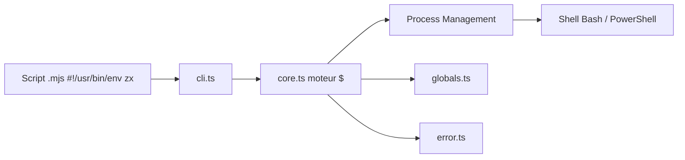

# google/zx

> Enveloppe JavaScript pour écrire des scripts shell plus lisibles, avec arguments échappés, pour développeurs Node.

## Le problème
Bash devient pénible dès que le script grossit, et la bibliothèque standard de Node demande du code de plomberie autour de `child_process`.

## Ce que ça fait vraiment
`zx` fournit la balise `$` : une commande écrite en gabarit de chaîne s'exécute et renvoie une promesse. Les variables interpolées sont échappées automatiquement. Les promesses permettent de lancer plusieurs commandes en parallèle. Il tourne sur Node, Bun, Deno et GraalVM, sous Linux, macOS ou Windows (Bash ou PowerShell), en JS ou TS, CJS ou ESM.

## Comment c'est branché


## Essayer
```bash
npm install zx
```
```js
#!/usr/bin/env zx
await $`cat package.json | grep name`
```

## Coût et pièges
Gratuit ; Node ≥ 12.17.0 pour la version complète (une variante `zx@lite` existe). Un script exécute réellement des commandes système : à relire avant de lancer.

## Ce que ce n'est pas
Pas un orchestrateur de tâches ni un remplaçant de Make. Il ne rend pas un script portable si les commandes appelées ne le sont pas.

## Alternatives
- zx@lite : version allégée citée dans le README.

## Pour toi
Surveiller : utile si tes scripts d'outillage sont déjà en JS, mais un profil Python couvre le même besoin sans ajouter Node.

