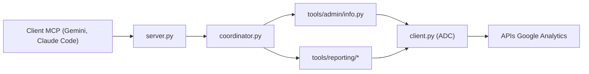

# googleanalytics/google-analytics-mcp

> Serveur MCP local, en lecture seule, qui laisse un LLM interroger Google Analytics.

## Le problème
Poser des questions sur ses propriétés GA (événements, dimensions, rapports) sans passer par l'interface ni écrire du code d'API.

## Ce que ça fait vraiment
Serveur Python lancé via `pipx run analytics-mcp`. Expose : résumés de comptes, détails de propriété, liens Google Ads, `run_report`, `run_funnel_report`, `run_realtime_report`, dimensions/métriques personnalisées. Utilise les API Admin et Data avec des Application Default Credentials au scope `analytics.readonly`. Aucune persistance locale n'est visible.

## Comment c'est branché


## Essayer
```bash
gcloud auth application-default login \
  --scopes https://www.googleapis.com/auth/analytics.readonly,https://www.googleapis.com/auth/cloud-platform \
  --client-id-file=YOUR_CLIENT_JSON_FILE
claude mcp add analytics-mcp \
  --scope user \
  -e "GOOGLE_APPLICATION_CREDENTIALS=PATH_TO_CREDENTIALS_JSON" \
  -e "GOOGLE_PROJECT_ID=YOUR_PROJECT_ID" \
  -- pipx run analytics-mcp
```

## Coût et pièges
Il faut un projet Google Cloud avec les deux API activées et des identifiants OAuth ou un compte de service. Le titre du README précise « Experimental ». Le README documente Gemini d'abord, Claude Code ensuite.

## Ce que ce n'est pas
Pas un outil d'écriture ni d'administration : lecture seule. Pas un entrepôt de données : chaque question rappelle l'API.

## Alternatives
Non documenté dans le README.

## Pour toi
Surveiller : utile seulement si tu as un site instrumenté avec GA ; la mise en place OAuth est le vrai coût.
