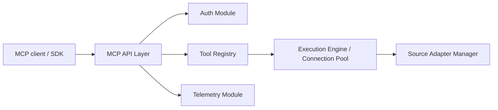

# googleapis/genai-toolbox

> Serveur MCP open source (MCP Toolbox for Databases) qui donne à des agents un accès outillé à tes bases de données.

## Le problème
Brancher un agent sur une base demande du code d'accès, du pooling, de l'authentification et de la traçabilité.

## Ce que ça fait vraiment
Deux usages : outils prêts à l'emploi (`--prebuilt=postgres` : list_tables, execute_sql) et outils personnalisés déclarés dans `tools.yaml` (sources, requêtes paramétrées, toolsets, prompts). Compatible avec de nombreuses bases (BigQuery, Postgres, MySQL, MongoDB, Snowflake…). Pool de connexions, IAM, OpenTelemetry, rechargement à chaud, SDK Python, JS et Go. Le dépôt est renommé mcp-toolbox.

## Comment c'est branché


## Essayer
```bash
npx @toolbox-sdk/server --config tools.yaml
./toolbox --config "tools.yaml"
./toolbox --ui
```

## Coût et pièges
Gratuit ; l'accès aux bases reste à ta charge et à sécuriser (mots de passe dans tools.yaml). Le catalogue dit « licence non déclarée » alors que le README affiche un badge Apache 2.0.

## Ce que ce n'est pas
Pas un générateur de SQL : les outils personnalisés sont écrits par toi. Le mode prébuilt npx est pratique mais moins fiable que le binaire.

## Alternatives
- Google Cloud MCP Servers : version gérée mentionnée dans le README.

## Pour toi
À adopter pour donner à un agent un accès contrôlé à une base : requêtes prédéfinies, authentification et traces d'origine.
