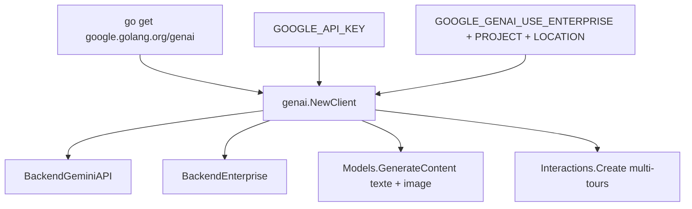

# googleapis/go-genai

> SDK Go officiel pour appeler les modèles Gemini, en API développeur ou en plateforme d'entreprise.

## Le problème
Deux points d'entrée Gemini coexistent — l'API développeur et la plateforme d'entreprise — avec des modalités d'authentification différentes.
Sans SDK, il faut écrire deux chemins d'appel et les maintenir séparément.

## Ce que ça fait vraiment
Un seul client, `genai.NewClient`, dont le champ `Backend` bascule entre `BackendGeminiAPI` et `BackendEnterprise`.
La configuration peut être entièrement portée par des variables d'environnement, le client se construisant alors avec une config vide.
`client.Models.GenerateContent` accepte des parties mêlant texte et données binaires, ce qui couvre le multimodal en quelques lignes.
L'API Interactions permet des conversations multi-tours avec des modèles ou des agents, via `client.Interactions.Create`.

## Comment c'est branché


## Essayer
```bash
go get google.golang.org/genai
export GOOGLE_API_KEY='your-api-key'
export GOOGLE_GENAI_USE_ENTERPRISE=true
export GOOGLE_CLOUD_PROJECT='your-project-id'
export GOOGLE_CLOUD_LOCATION='us-central1'
```

## Coût et pièges
La consommation des modèles Gemini est facturée sur ton compte ; le mode entreprise suppose un projet cloud et une région.
`GenerateVideos` va perdre ses arguments `prompt`, `text` et `image` au profit de `source` : le README recommande d'épingler la version `< 2.0.0` pour éviter la rupture.

## Ce que ce n'est pas
Pas un framework d'agents : l'API Interactions gère le multi-tours, pas l'orchestration d'outils complète.
Pas une exécution locale : tout passe par les services Google.
Pas figé : un avertissement de rupture à venir figure dès l'en-tête du README.

## Alternatives
Aucune alternative nommée dans le README.

## Pour toi
Sans intérêt tant que tu n'écris pas de Go et que ta pile n'est pas sur Gemini.
