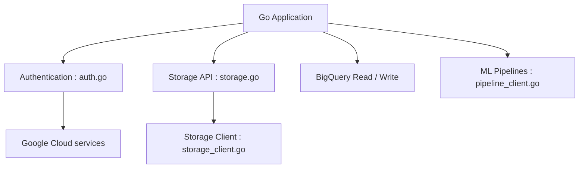

# googleapis/google-cloud-go

> Bibliothèques clientes Go pour appeler les services Google Cloud, avec authentification automatique.

## Le problème
Appeler Cloud Storage, BigQuery ou d'autres services depuis Go sans écrire les appels HTTP/gRPC à la main.

## Ce que ça fait vraiment
Collection de paquets Go, un par service. Chaque client utilise les Application Default Credentials par défaut, ou un fichier de clé de compte de service, ou des credentials explicites. Le paquet Storage ajoute une API objet de plus haut niveau. Certains paquets peuvent changer sans compatibilité.

## Comment c'est branché


## Essayer
```bash
go get cloud.google.com/go/firestore@latest
gcloud auth application-default login
```
```go
client, err := storage.NewClient(ctx)
```

## Coût et pièges
Le code est gratuit ; les appels aux services sont facturés par Google Cloud. Compte et credentials requis.

## Ce que ce n'est pas
Pas un seul client : un paquet à installer par service. Inutile hors Google Cloud.

## Alternatives
Aucune alternative nommée dans le README.

## Pour toi
À surveiller : nécessaire si tes pipelines Go parlent à GCP (BigQuery, Storage), sans objet sinon.

