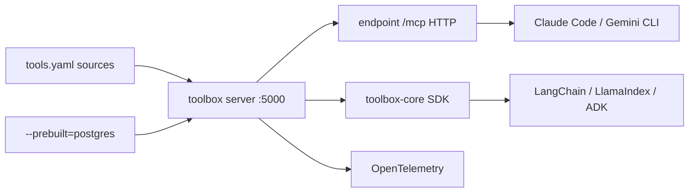

# googleapis/mcp-toolbox

> Serveur MCP qui branche un agent sur des bases de données, en générique ou en outils sur mesure.

## Le problème
Donner un accès base de données à un agent, c'est soit ouvrir un `execute_sql` à
tout faire, soit écrire à la main un outil par requête, avec l'auth et le pooling.

## Ce que ça fait vraiment
Double usage. Au build : `--prebuilt=postgres` expose instantanément des outils
génériques (`list_tables`, `execute_sql`) à Gemini CLI, Claude Code, Codex, Antigravity.
Au run : un `tools.yaml` déclare des `sources` (connexions), des `tools` (requête
paramétrée typée, avec `statement` SQL et `parameters`), des `toolsets` (groupes
chargeables), des `prompts` et des `resources`/`resourceTemplates` en lecture seule.
Pooling de connexions, auth IAM intégrée, traces OpenTelemetry. Bases couvertes :
AlloyDB, BigQuery, Cloud SQL, Spanner, Firestore, PostgreSQL, MySQL, MariaDB, SQL
Server, Oracle, MongoDB, Redis, Elasticsearch, CockroachDB, ClickHouse, Couchbase,
Neo4j, Snowflake, Trino. SDK Python, JS/TS et Go, avec adaptateurs LangChain,
LlamaIndex, Genkit, ADK.

## Comment c'est branché


## Essayer
```bash
npx @toolbox-sdk/server --prebuilt=postgres --stdio
npx @toolbox-sdk/server --config tools.yaml
brew install mcp-toolbox
go install github.com/googleapis/mcp-toolbox@v1.12.0
pip install toolbox-core
```

## Coût et pièges
Apache 2.0, serveur gratuit. Le dépôt `genai-toolbox` a été renommé `mcp-toolbox` :
il faut mettre à jour le remote. Le rechargement dynamique est actif par défaut
(`--disable-reload` pour le couper). L'exemple de `source` met le mot de passe en
clair dans le YAML. Google pousse en parallèle une offre managée payante.

## Ce que ce n'est pas
Pas une base ni un ORM : une couche d'exposition. Le mode prebuilt n'est pas sûr par
défaut — c'est le mode outils sur mesure qui apporte l'accès restreint et les
requêtes structurées.

## Alternatives
- Google Cloud MCP Servers : la version managée, sans auto-hébergement.
- Gemini CLI extensions : installation clé en main par base, mais limitée à Gemini.

## Pour toi
La bonne façon de donner un accès SQL cadré à un agent — le `tools.yaml` vaut le
détour même sans Google Cloud.
