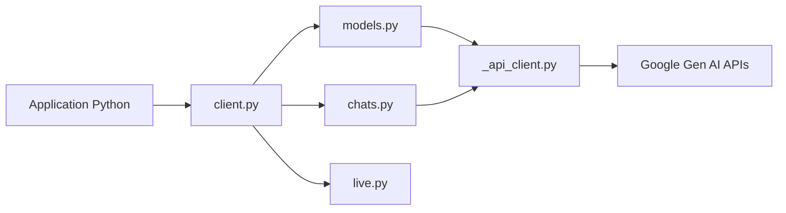

# googleapis/python-genai

> SDK Python officiel de Google pour appeler Gemini (API Developer ou plateforme Enterprise) depuis une appli.

## Le problème
Appeler les modèles Gemini à la main (HTTP, auth, streaming, fichiers, batch) est fastidieux et diffère entre l'API Developer et la plateforme Enterprise (ex-Vertex AI).

## Ce que ça fait vraiment
Un `Client` unique expose `models` (generate_content, embeddings, images Imagen, vidéo Veo, comptage de tokens), `chats`, `files`, `caches`, `batches`, `tunings`, `interactions` et `live`. Les entrées acceptent des types Pydantic ou des dicts ; le mode async passe par `client.aio`. Le transport est httpx, aiohttp en option. L'appel automatique de fonctions Python et un support MCP expérimental sont inclus.

## Comment c'est branché


## Essayer
```bash
pip install google-genai
uv pip install google-genai
export GEMINI_API_KEY='your-api-key'
```
```python
from google import genai
client = genai.Client()
response = client.models.generate_content(
    model='gemini-flash-latest', contents='Why is the sky blue?'
)
print(response.text)
```

## Coût et pièges
Clé Gemini ou projet Google Cloud requis ; les appels sont facturés par Google. Le README annonce une prochaine version majeure qui retire l'appel automatique de fonctions depuis `generate_content` et plusieurs méthodes `Live` : épingler `< 3.0.0`.

## Ce que ce n'est pas
Pas un framework d'agents ni un client multi-fournisseurs : il ne parle qu'aux API Google. Certaines fonctions (tunings, batch, upscale) ne marchent que sur la plateforme Enterprise, d'autres (files) seulement sur l'API Developer.

## Alternatives
- google-gemini/gemini-skills et google/skills : skills à charger dans un assistant de code pour qu'il écrive du code SDK à jour.

## Pour toi
À adopter dès que tu utilises Gemini en Python : c'est le client maintenu par Google, avec 315 issues ouvertes mais un push récent ; surveille le passage en 3.0.

